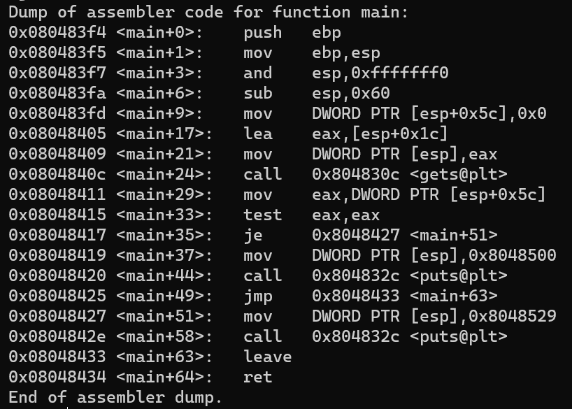

# Analysis

* We are given with the below source code:

    

* Try some random inputs:

    

# Exploit

* We open the *stack0* in GDB and disassemble the main function:

    

* In the *<main+9>* line, 0x0 is moved to address *esp+0x5c*, then it's moved to EAX and call *test eax, eax* to check if this varable is 0 or not. So this is our *modified* variable.

* The *<main+17>* tells us that the *buffer* array starts at address *esp+0x1c*.

    

* Here it calls *gets* to retrive the user's input.

* Notice that *0x5c - 0x1c* is 64 bytes. So *buffer* and *modified* are allocated right next to each other on the stack. 

* So we can modify the *modified* variable by writing past the space allocated space for *buffer*:

# The bugs:

* If you take a look at the *man* page for *gets*, you'll know why we can exploit it:

    

