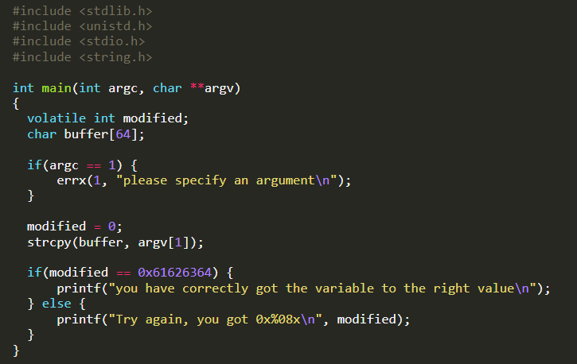
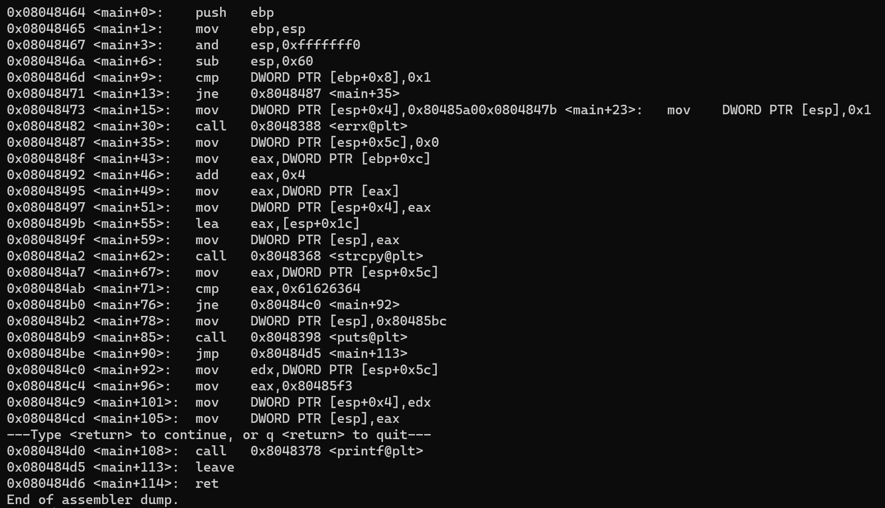
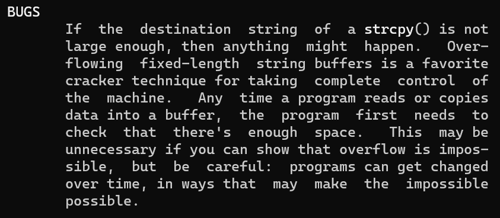

# Analysis

* We are given with the below source code:

    

* Try some random inputs:

    

* It returns some weird address.

# Exploit

* Go ahead and open it in GDB and disassemble the main function:

    

* The frist few lines are the same as *stack0*. So lets try that exploit code in here:

    

* As you can see, the hex value of "a" (which is 41) is written to the memory allocated for the *modified* variable. This means that we can write 4 bytes past the space allocated for *buffer* to contain whatever byte value we want. 

* Since there is a check: 
    
     

    - We will append 0x61626364 to the end of our exploit string. But notice that x86 is little-endian, we will put 0x64636261 at the end of the string, which in ASCII is *dcba*.

* Result:

    

# The bugs:

* Again, take a look at the *man* page for *strcpy*, it says: *"Over‐
       flowing  fixed-length  string buffers is a favorite
       cracker technique for taking  complete  control  of
       the  machine."*

    
    

