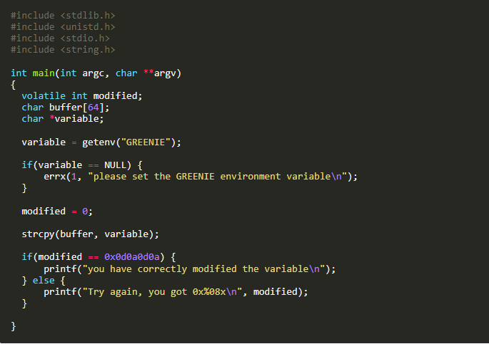

# Analysis

* We are given with the below source code:

    

* Try some random inputs:

    

* It says: *please set the GREENIE environment variable*. Look like we have something to do with environment variables here.

# Exploit

* Again, this is pretty similar to the previous level except that the data is passed in via the enviromental variable *GREENIE* and we need to write *0x0d0a0d0a* to *modified*.

* Lets try the exploit from *stack0* here. But instead of passing it to the program, we want to pass this value to a environment variable *GREENIE*:

    

* Now run the program:

    

* As you can see, we have written the hex value of "a" (61) to the memory allocated for *modified*. Do the samething we did in the previous level:

    

* Result:

    

# The bugs:

* The bug appeared in this program is that *getenv* is not bounding the buffer length. This is where security bugs like buffer overrun often originate from.

    

    

