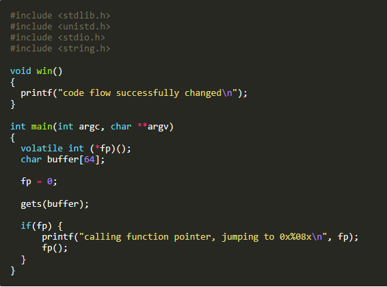
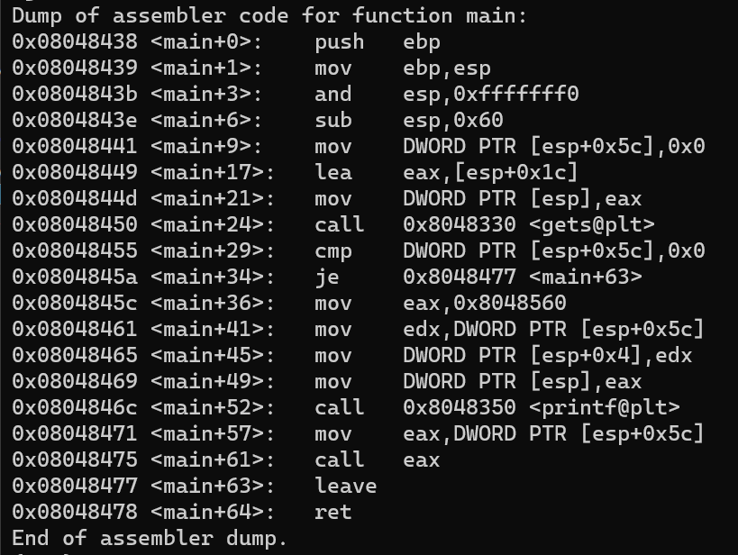

# Analysis

* We are given with the below source code:

    

* Try some random inputs:

    

* It doesn't show anything! 

* Our goal here is to try to make it call the *win()* function.

# Exploit

* Lets load this in GDB:

    

* So in here, as in *stack0*, the *fp* variable is located at memory address *esp+0x5c* and *buffer* starts at *esp+0x1c*.

* The key point of the program is in the following lines:

    

* We move *fp* to *eax* and then it is called. If we can change *fp* so that it points to the memory location of *win()*, we have our wishes.

* In order to do that, we must first find the address of *win()*, then append it to the exploit code we've written earlier.

* With *info functions* and *disas win*, we see that the function starts at *0x08048424*:

    

* So now just do the thing we've done in the previous levels:

    

# Bugs

* Same as previous level, the bug is at the *gets* function.

    

