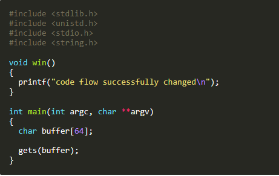
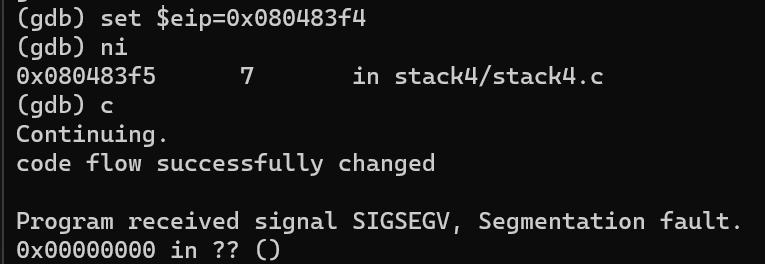
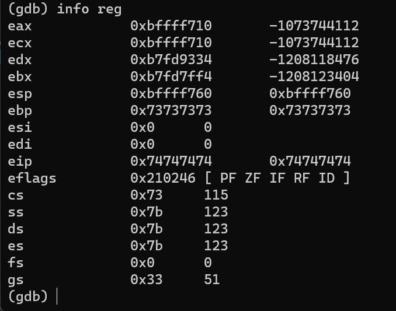

# Analysis

* We are given with the below source code:

    

* Try some random inputs:

    

* Ok, just like *stack3*, nothing is shown. But unlike *stack3* there is no function pointer variable we could overwrite! 

* Our goal is still to execute *win()*.

# Exploit

* Let me do a little recall. When a function is called, the address where we want to return to, will be pushed on the stack. And when *ret* is called, it will pop this address off the stack. Thus jumping back where we came from. 

* So instead of overflowing a local variable, we can overflow the return pointer. And when main would return, it will read the wrong value and jump there instead! (here we want to jump to *win()*)

* So lets open GDB and find *win()*'s address:

    

* So this is the address we want to jump to. There are several approaches to this. The easy way is just to set $EIP to this address. Then it will call *win()*:

    

* But that's not what we're trying to do here. We're trying to write an exploit code. So lets do that.

* There is a cool trick to know how many bytes it takes to overflow a variable (return pointer as well). I'll write a simple python code:

    

* This is the padding we will be using. We will see what stored in EBP and EIP after run the program with this. Thus know how many bytes we need. (I put the result in /exp).

    

* It stops at 0x74747474, which is "tttt". If you look at the register, you'll see:

    

* EBP is 0x73737373 ("ssss"). So I'll modify the exploit code:

    

* Now run it:

    

# Bugs

* Same as previous level, the bug is at the *gets* function.

    

