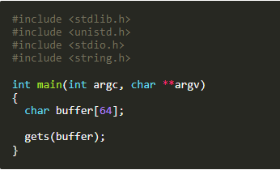
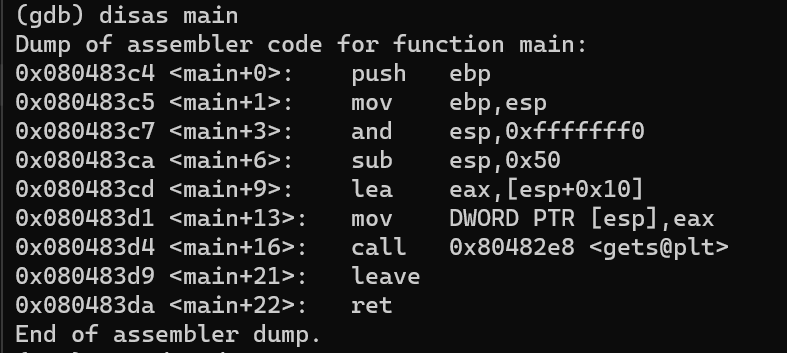
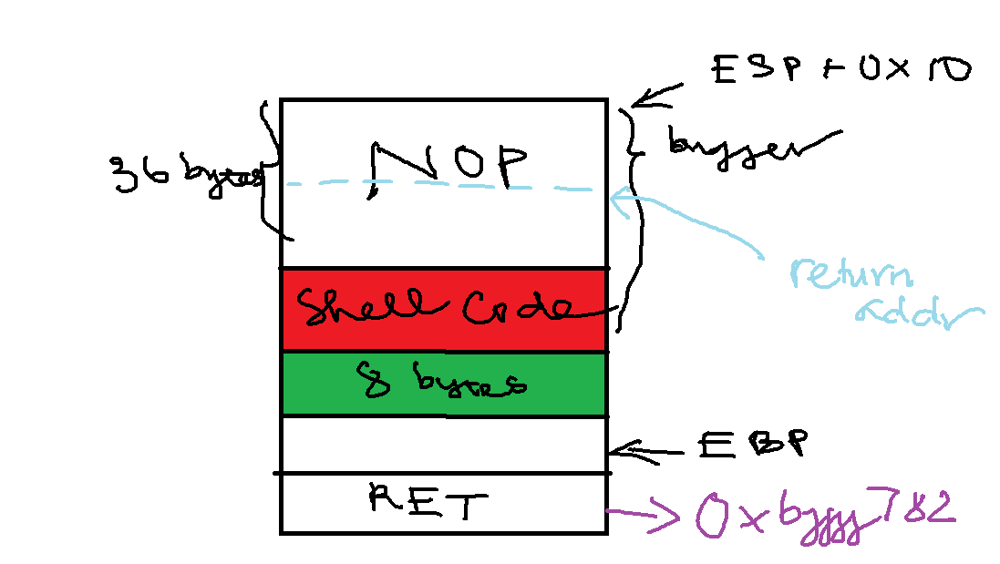

# Analysis

* We are given with the below source code:

    

* Try some random inputs:

    

* Ok, this is surprisingly small. And there is only 1 function call to *gets*.

* At this point, our goal is to get from no functionality of the program, to the root shell.

* Quick reminder, shellcode is a series of instructions (usually encoded as bytes) that can pwn a shell in applications such as buffer overflow.

# Exploit

* Load this in GDB:

    

    - As can be seen, *buffer* is allocated at *esp+0x10*.

* We will again try to overwrite the return pointer (since there are no local variables) to point it to our shellcode.

* I use the shellcode here (28 bytes):

    

* I don't quite know what the third line (*and esp, 0xfffffff0*) does. So I'll set a breakpoint there and look at the registers:

    

    - So looks like there will be a padding of size 8 allocated under the *buffer* (at higher address).

    - Under that, there is EBP, then RET.

* So we will put our shellcode in the *buffer* variable, then hope the program will return and start executing the shellcode.

* What I'll do is that I will append the shellcode at the end of the *buffer*. And before it (at lower address), we have to make sure that these are not random bytes. Because if it is, and we run in different directory (which will be discussed after this), it may not jump to the shellcode, but these random bytes instead!

    - So we'll going to use NOP (No-Operation).

    - Imagine, you're at the top of the hill, and you throw a ball. Down the hill, is our shellcode. So when it reaches the end, it will execute the shellcode. NOP will actually do it for us. But we need something to throw, right? And that, specifically, is an address. 

    - We have to find the address of somewhere halfway within this NOP. And the reason for halfway is that if we placed it at the begining or at the bottom of our NOP and we run in a different directory, we could be jumping somewhere above or under our buffer.  
    
    - The remaining size of *NOP* is 64-28=36 bytes. So we should be aiming for 18 (0x12). So we will want esp+0x10+0x12 = esp+0x22. This is where we'll store our return address. 

    - After *sup esp, 0x50*, it's value will be:

        

    - So, 0xbffff760 + 0x22 = 0xbffff782, is our desired return address. 

* I will draw everything out real quick:

    

* Now lets write our exploit code:

    

    - We will fill the padding (the green one) with "a" * 8 and our EBP (since it's 4 bytes) with "b" * 4.

    - NOP is 0x90.

* Runs like butter:

    

* Note: If you run the same payload in a different directory, it may work differently. This is because environment variables are stored on the stack. But what if our stack directory has more or fewer environment variables than other directories? It will jump to a different location other than our shellcode. Thus does not run as it may.

* Here is another solution by LiveOverflow: https://www.youtube.com/watch?v=HSlhY4Uy8SA&list=PLhixgUqwRTjxglIswKp9mpkfPNfHkzyeN&index=15 

# Bugs

* Same as previous level, the bug is at the *gets* function.

    

