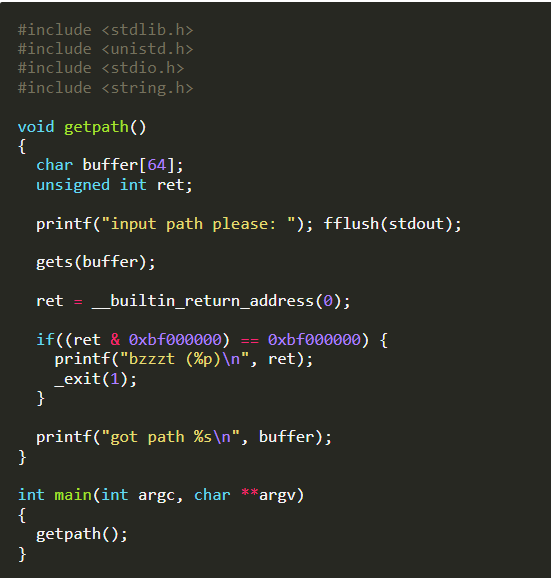
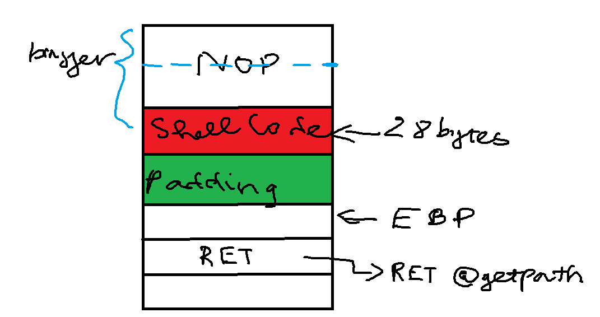
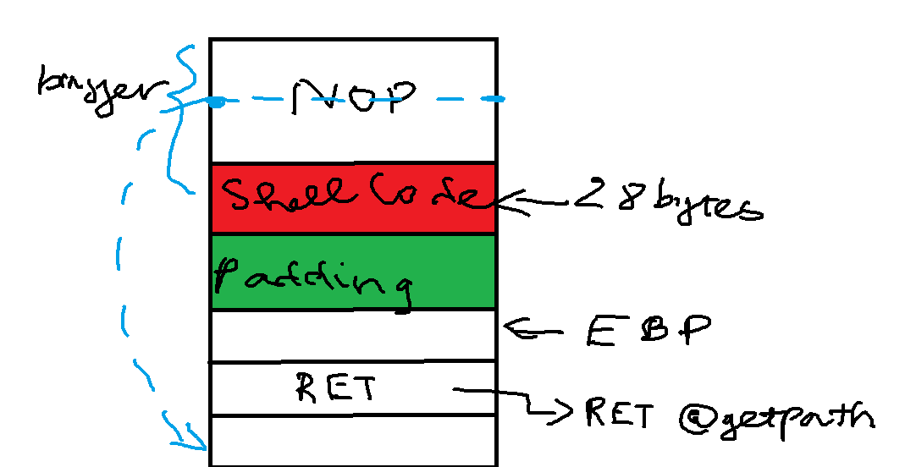
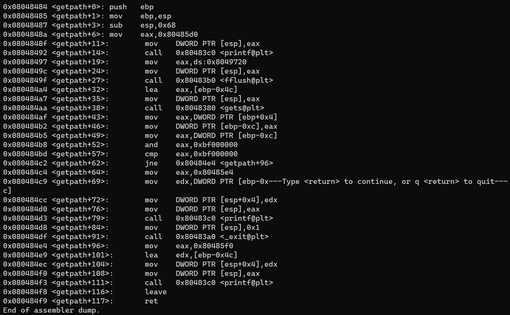
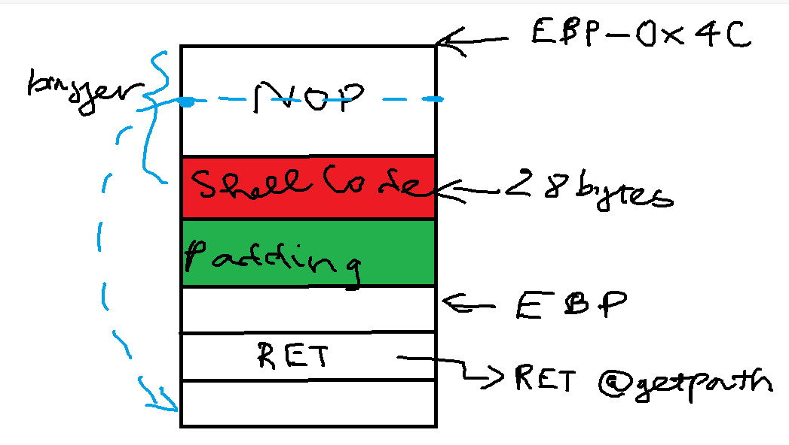
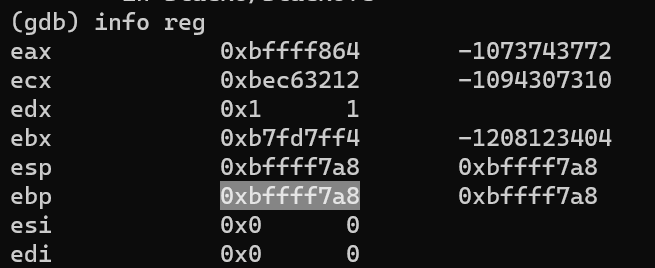

# Analysis

* We are given with the below source code:

    

* Try some random inputs:

    

* *__builtin_return_address* is a function from the compiler used to read the current return address from the stack. 

* *(ret & 0xbf000000) == 0xbf000000* is used to check if the return address starts with 0xbf or not (Since 0xbf... is the location on the stack that contain executable shellcode).

* When we overflow the *buffer* with *gets*, we're actually gonna affect the *ret* variable, which is then checked. If it starts with 0xbf, then it prints out that return address, and exit.

* Before we move on, I want to address a couple of ways to prevent buffer overflow exploitation: *Stack-smashing protection, ASCII armoring, Address space layout randomization (ASLR)* and *non-executable stack*. (https://en.wikipedia.org/wiki/Return-to-libc_attack#Protection_from_return-to-libc_attacks)

* Apperantly, a *non-executable stack* can prevent some buffer overflow exploitation, however it cannot prevent a *ret2libc* attack because in the *ret2libc* attack only existing executable code is used.

# Exploit (return to .text)

* Nothing in here that says the stack isn't executable, so the method we used in *stack5* is not out of the window completely. But we just can't return to the stack at first. 

* How about the return address? Clearly we can not return back into the stack because the check will kill our process. But we can return back into our program, into the text area. 

* As you can see, *getpath()* has a return instruction and if we can put that return instruction at our *ret*, what will happen is there will be a return and it will simply return again (returning again to the address below the *ret*):

    

* But anyway, we can overwrite the last one (under the *ret*) with the address in the middle of NOP (like previous level). 
    
    

* And this will cause a return (or jump) to the NOP, which finally execute our shellcode. So basically we just returning and returning to another address. 

* This *ret @getpath* is actually a gadget because it is an executable instruction sequence that is not on the stack (it is on the text area). 

    

* So all that's left to do is to find how many bytes are in the padding and the 2 addresses we want to return to.

* This can be easily done with the help of GDB:

    

* Easy seeing, *buffer* starts at *ebp-0x4c*, which means we need to write 80 bytes (0x4c + 4 bytes of old EBP) plus the 4 bytes we want EIP to be after the *ret* instruction.  

    

    - So, buffer is of size 64 and 0x4c is 76. That means the padding's size is 12. We will fill it with 'a's.

    - Next we have to find *ret @getpath*, which is the return address of *getpath*. This is quite obvious:

        

    - Lastly, the address at the mid of NOP. NOP is 36 bytes of size, and half of that is 18 (0x12). Also, it starts at *ebp-0x4c*, so mid of that is *ebp-0x4c+0x12* which is *ebp-0x3a*. 

    - Okay so we have to find EBP after it is pointing to the saved EBP (the one in between RET and PADDING). Lets set a breakpoint here after it is assigned with ESP:

        

    - Look at the registers: 

        

    - That's EBP. So now we have to subtract it with 0x3a to find the second return address we're looking for. (0xbffff76e)

    - We will still use the shellcode from the previous level.

* Now lets write our payload:

    

* Boom:

    

* This LiveOverflow's video demonstrates another approach to this (https://www.youtube.com/watch?v=m17mV24TgwY&list=PLhixgUqwRTjxglIswKp9mpkfPNfHkzyeN&index=18).

# Bugs

* Same like previous levels, the bug is at the gets function.
