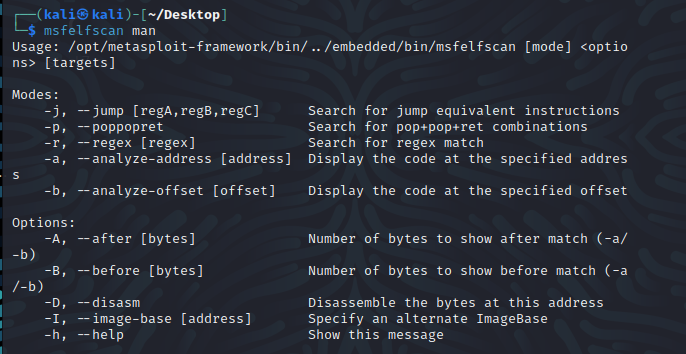
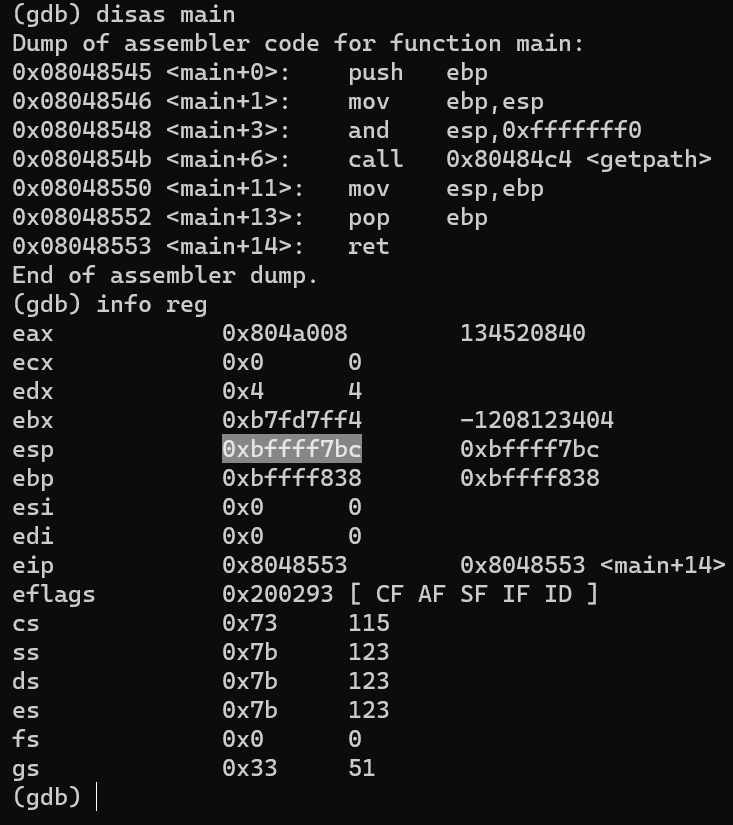

# Analysis

* We are given with the below source code:

    

* The code is very similar to <span style="color:red">*stack6*</span>. If we try the same payload (modify the <span style="color:red">*ret1*</span>):

    

* And run it like we did in the previous level, we still got the shell:

    


# Exploit

* But the discription says: "<span style="color:red">*msfelfscan*</span> can make searching for suitable instructions very easy". So why not use that?

* Take a look at the man page of <span style="color:red">*msfelfscan*</span>:

    

* Here I'll use the -p option, to find the pop, pop, ret combinations.

```
kali@kali:~/Desktop$ msfelfscan -p stack7
[stack7]
0x08048492 pop ebx; pop ebp; ret
0x080485c7 pop edi; pop ebp; ret
0x080485f7 pop ebx; pop ebp; ret
```

* Lets use the first one. 

* I'll set a breakpoint at the <span style="color:red">*ret*</span> instruction of both <span style="color:red">*getpath*</span> and <span style="color:red">*main*</span> to get the value of ESP when <span style="color:red">*ret*</span> is executed:

    

* So lets write the payload:

    

    - We know that <span style="color:red">*padding*</span> is of size 80. So we'll fill it with "A"s

    - The shellcode is from shellstorm.

    - EIP is the address of the <span style="color:red">*ret*</span> instruction of <span style="color:red">*getpath*</span> (like what I modify in the begining).

    - The + 20 is just an estimation. You can add whatever, as long as it's in range of (0, 80=0x50) (since buffer is 80 bytes, and you want to put the address halfway like the previous levels).

* Ok now run it:

    

# The bugs:

* Same like previous levels, the bug is at the <span style="color:red">*gets*</span> function.
