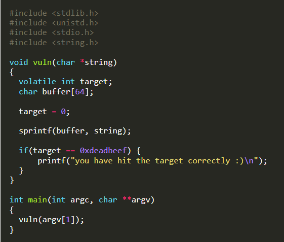
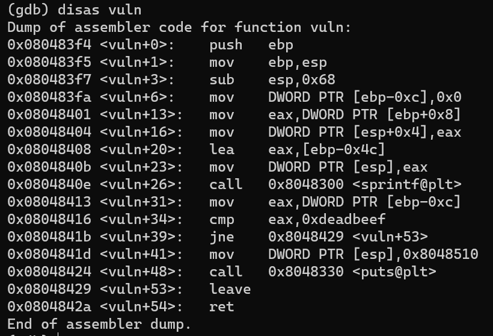

# Analysis

* We are given with the below source code:

    

* Try some random inputs:

    

* We can obviously do this with a standard buffer overflow, but is says it can be done with less than 10 bytes of input. So we'll want to do this by exploiting format strings.

# Exploit

* Lets open this in GDB:

    

* In *<vuln+6>*, it *mov DWORD PTR [ebp-0xc],0x0*. So this is our *target* variable. It starts at [ebp-0xc]. Similarly, *buffer* starts at [ebp-0x4c].

* The distance between *target* and *buffer* is 0x4c-0xc=0x40=64 bytes. So we need to write pass *buffer* into *target* with 64 bytes + 4 bytes we want *target* to be (in this case: 0xdeadbeef).

* One method of exploiting format strings is pretty similar to buffer overflows. You can write a large string into a buffer with a relatively short format string. For example, a format string %32d results in a 32 byte string.

* Without further ado, lets write the exploit code:

    

# Bugs

* The vulnerability is at the *sprintf* function:

    
