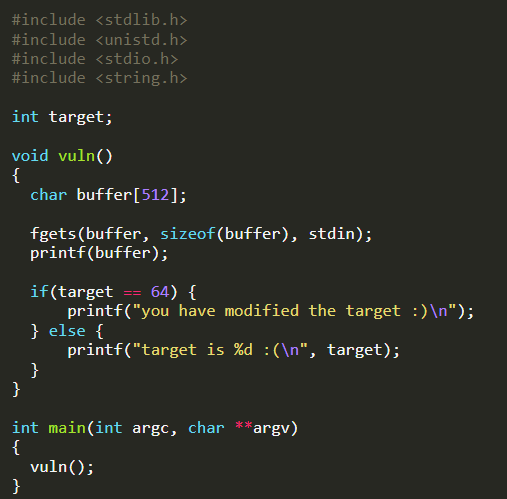

# Analysis

* We are given with the below source code:

    

* Try some random inputs:

    

* Everything is similar to *format1*, except that we now have to write a specific value to *target*. 

* *fgets()* doesn't allow us to write more bytes than the length we provide. So we can't do a buffer overflow here. But then the input is passed directly to *printf()*, which is vulnerable to format string exploit.

# Exploit

* Lets find the address of *target* with GDB:

    

* We locate the start of our input string. This time, it's much easier since it gets copied to a buffer in the same stack frame as our *printf()* function:

    

* Now replace "AAAA" with the address we've just found:

    

* This is easy, we just have to fill whatever's left with "a"s:

    

* But let me show u a cool trick: we can use *%nu* where n is a number that we can manipulate to write the number of bytes we want. So start with this:

    

* Simple math, we need %47u:

    

# Bugs

* The vulnerability is at the *printf* function (like in the previous level).

