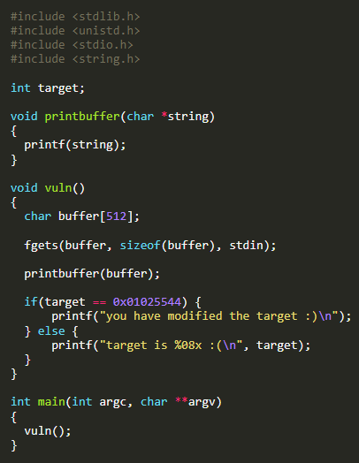

# Analysis

* We are given with the below source code:

    

* Lets try some random inputs:

    

* Everything is similar to format 2 except that we now have to precisely control what is written to <span style="color:red">*target*</span>.

# Exploit

* Again, we start by locating the start of our input string.:

    

* And also, the memory address of <span style="color:red">*target*</span>:

    

* This shows that we are able to write to <span style="color:red">*target*</span>:

    

* Since we can write to all 4 bytes at once, we can try to write a byte a time for four times in a row.

    

    - We can supply different addresses one after another on the stack and supply multiple %n parameters to write to the least significant byte of each address in sequence.

* For example, we can use the following information:

```
080496f4 -> Address 1 -> Modifies Byte 1
080496f5 -> Address 2 -> Modifies Byte 2
080496f6 -> Address 3 -> Modifies Byte 3
080496f7 -> Address 4 -> Modifies Byte 4
```

* To modify all these values, let’s construct a valid structure:

```
Value1 +  Address 1 + Value2 + Address2 + Value3 + Address3 + Value4 + Address4 + '%x'*11 + "%u%n" + %u%n + %u%n + %u%n
```

* This structure contains the following:

    - value + address 4 times
    - 11 %x of padding
    - %u%n 4 times <- with this we will control the values of the bytes

* Lets run this:

    

* So, we need to calculate the offset for each %u. I use this python script: (this was taken from https://www.ayrx.me/protostar-walkthrough-format/)

```
def calculate(to_write, written):
    to_write += 0x100
    written %= 0x100
    padding = (to_write - written) % 0x100
    if padding < 10:
        padding += 0x100
    print padding
```

* For the first byte, we need 44, and we have 67. Lets pass this as parameters to our script (0x44=68,0x67=103):

    

    - So we'll use %231u:

        

* Keep doing this, and we are done:

    

# Bugs

* Same like previous levels, the bug is at the <span style="color:red">*printf*</span> function.

