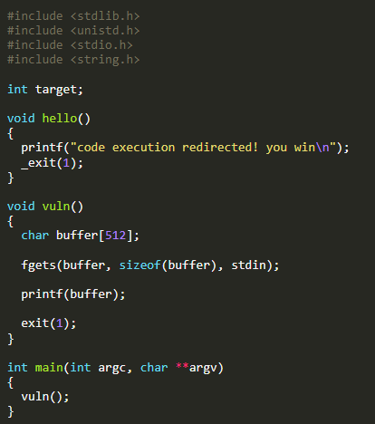
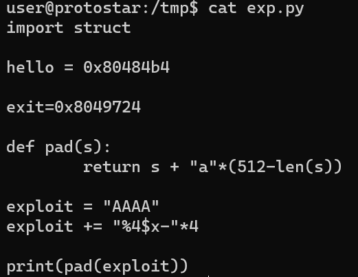
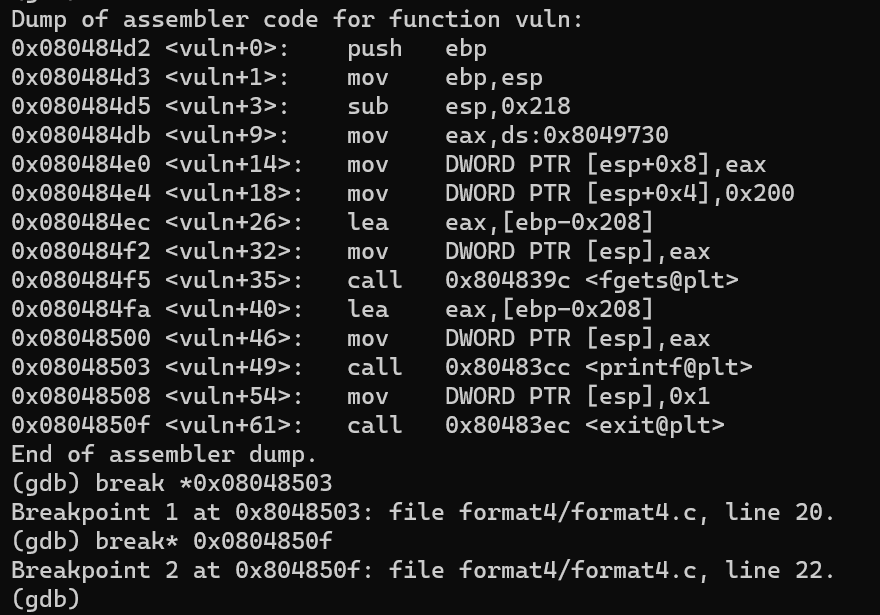
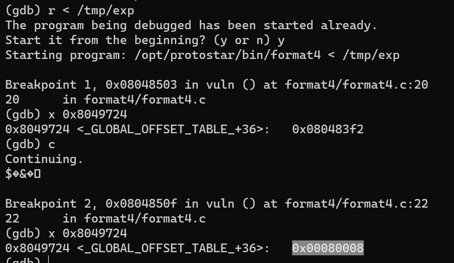
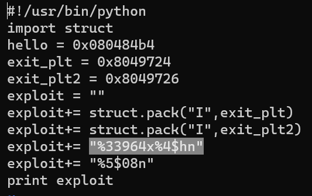
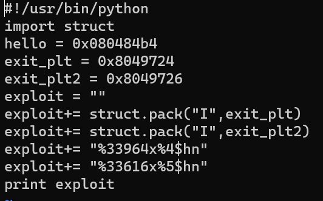
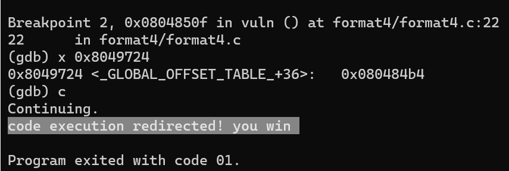

# Analysis

* We are given with the below source code:

    

* Lets try some random inputs:

    

* It says here: "format4 looks at one method of redirecting execution in a process". So we'll use that to execute the <span style="color:red">*hello()*</span> function.

* Notice how here after the <span style="color:red">*printf()*</span> we have an <span style="color:red">*exit()*</span>? Well that was placed there by intention, because <span style="color:red">*exit()*</span> is part of libc, so there will be a global offset table (GOT) for it which we can overwrite:

    

    - Then when we call <span style="color:red">*exit()*</span>, <span style="color:red">*hello()*</span> will be executed instead.

    - GOT:

        

* Keep in mind that we cannot overwrite the return pointer, because we never return, so we have to make use of this GOT guy.

# Exploit

* Again, we start by locating the start of our input string:

    


* And also, the memory address of <span style="color:red">*hello()*</span>:

    

* One more thing, the address of <span style="color:red">*exit()*</span> in global offset table:

    

* We will use the payload from previous level, but we're gonna modify it a bit:

    - 0x080484b4 (address of hello()) will be split into 2 part: 0x0804 and 0x84b4.

    - 0x84b4 will be written on "0x8049724" and 0x0804 will be written on "0x8049726".

    - You might wonder, why do this? Why not just write all to one address? Well, this is because the address of <span style="color:red">*hello()*</span> - 0x80484b4 is a very big number. We simply can not write it all (takes up to ~ 128MB). So with this trick, it constructs the whole 4 bytes through writes.

* But first let see if we can write arbitrary values on 0x8049724 as well as 0x8049726. I use this script:

```
#!/usr/bin/python
import struct
hello = 0x080484b4
exit_plt = 0x8049724                      
exit_plt2 = 0x8049726
exploit = ""
exploit+= struct.pack("I",exit_plt)
exploit+= struct.pack("I",exit_plt2)
exploit+= "%4$08n"
exploit+= "%5$08n"
print exploit
```

* Note: the number dollar notation can be used to specifically reference that 'number-th' offset. So, 4$ would attempt to reference the 4th parameter of printf instead of going through the parameters one after another:

    

    

* Okay, lets continue. First, set breakpoints at the call to printf() and exit():

    

    - Now run it with the payload:

        

    - Sweet, we can write to those addresses. 

* Now, we just need to calculate the width field in order to output our desired values.

    - Written value was "0008." So we need to subtract "0008" from our desired value = "0x84b4": 33964.

    - Lets update our script:

        

    - And the result:

        

    - Again, Written value was "0x84b4." So we need to subtract "0x84b4" from our desired value = "0x0804". But 0x0804 is smaller than 0x84b4. In this case, we can overflow into the next byte to get our desired value on the target location: 0x10804 - 0x84b4 = 33616.

    - Our final script:

        

    - And we're done:

        

# Bugs

* Same like previous levels, the bug is at the <span style="color:red">*printf*</span> function.


