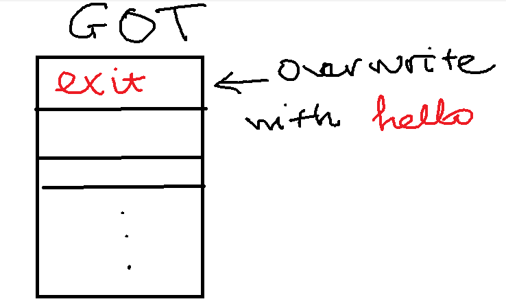

# Analysis

* We are given with the below source code:

    

* Lets try some random inputs:

    

* It says here: "format4 looks at one method of redirecting execution in a process". So we'll use that to execute the <span style="color:red">*hello()*</span> function.

* Notice how here after the <span style="color:red">*printf()*</span> we have an <span style="color:red">*exit()*</span>? Well that was placed there by intention, because <span style="color:red">*exit()*</span> is part of libc, so there will be a global offset table for it which we can overwrite:

    

    - Then when we call <span style="color:red">*exit()*</span>, <span style="color:red">*hello()*</span> will be executed instead.

    - GOT:

        

# Exploit

* Again, we start by locating the start of our input string:

    


* And also, the memory address of <span style="color:red">*hello()*</span>:

    

* One more thing, the address of <span style="color:red">*exit()*</span> in global offset table:

    

* We will use the payload from previous level, but we're gonna modify it a bit:

    - 0x080484b4 (address of hello()) will be split into 2 part: 0x0804 and 0x84b4.

    - 0x84b4 will be written on "0x8049724" and 0x0804 will be written on "0x8049726".

* But first let see if we can write arbitrary values on 0x8049724 as well as 0x8049726. I use this script:

```
#!/usr/bin/python
import struct
hello = 0x080484b4
exit_plt = 0x8049724                      
exit_plt2 = 0x8049726
exploit = ""
exploit+= struct.pack("I",exit_plt)
exploit+= struct.pack("I",exit_plt2)
exploit+= "%4$08n"
exploit+= "%5$08n"
print exploit
```

* First, set breakpoints at the call to printf() and exit():

    

    - Now run it with the payload:

        

    - Sweet, we can write to those addresses. 

* Now, we just need to calculate the width field in order to output our desired values.

# The bugs:

* Same like previous levels, the bug is at the <span style="color:red">*printf*</span> function.


