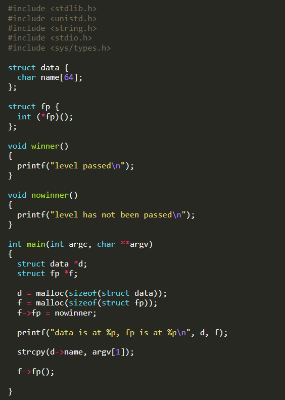
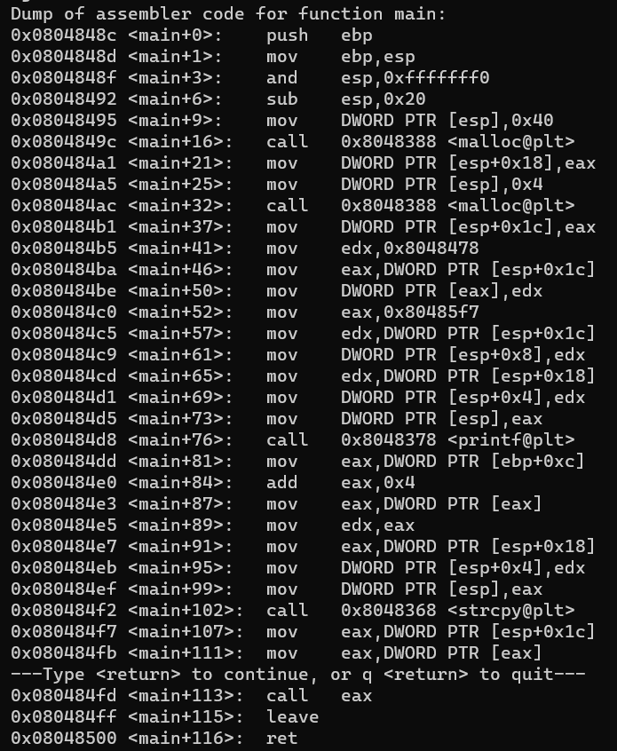
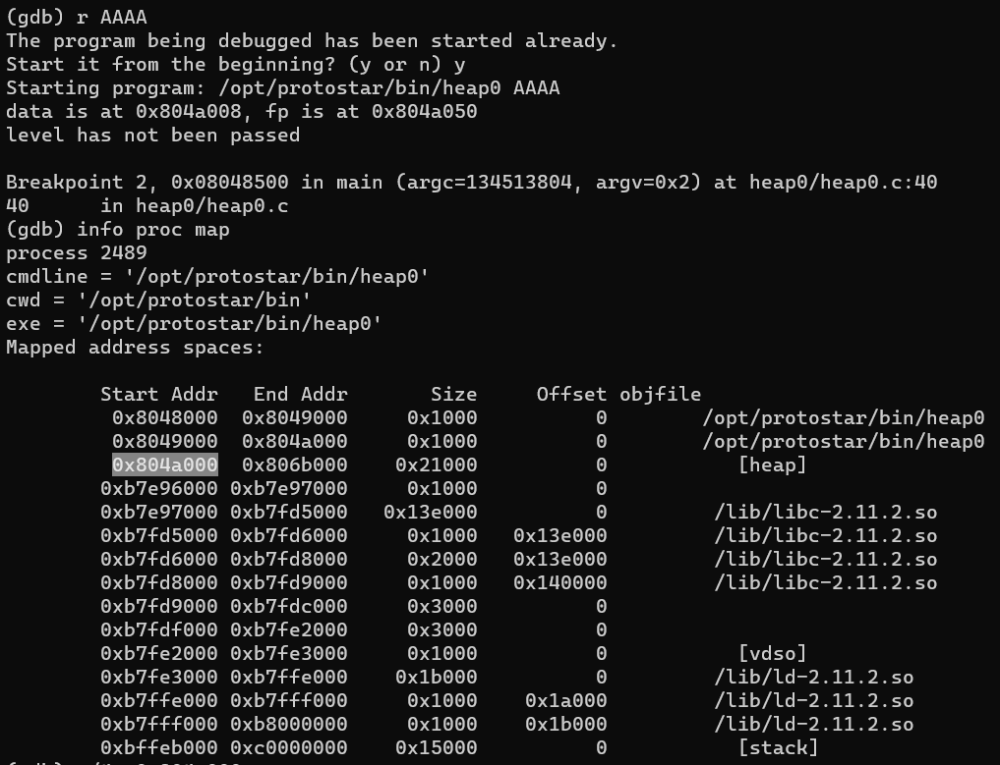

# Analysis

* We are given with the below source code:

    

* Lets try some random inputs:

    

*  We have a buffer overflow on the *name* buffer that is allocated on the heap.

    - Just like the stack, heap memory is allocated contiguously. 
    
    - This means that if we write past the buffer, we will be overwriting another data structure.

* Our goal is to execute the *winner* function.
# Exploit

* Load this in GDB:

    

* In <main+41>, we examine the address moved into EDX:

    

    - So this is the address of our *nowinner* function.

    - Similarly, the address of *winner* is 0x8048464.

* Set a breakpoint at the return instruction of main, supply an input and look at the info proc map:

    

* So the heap starts from 0x804a000. Also, at the heap memory, we can see where our "AAAA" input is stored on the heap:

    

* Now, we want to overwrite *nowinner*'s address with *winner*'s address,  which will then be executed by f->fp().

* Ok, so the f->fp address is 0x0804a050 and the beginning of our d->data buffer is at 0x0804a008. So if we fill d->data with 72 bytes (0x0804a050 - 0x0804a008) plus 4 bytes we want f->fp to be after this (0x8048464):

       

# The bugs:

* This level is vulnerable because we can pass as many bytes as we want via the *name[64]* and the *strcpy*:

    

