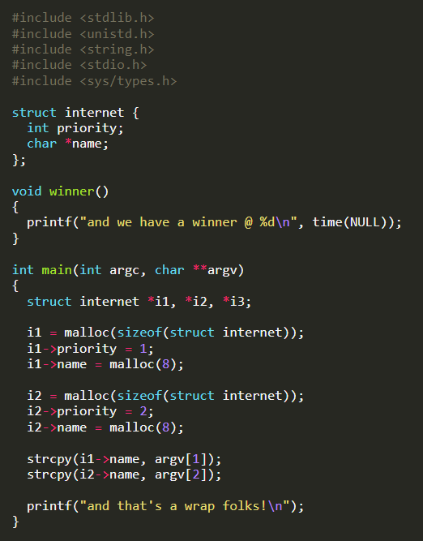
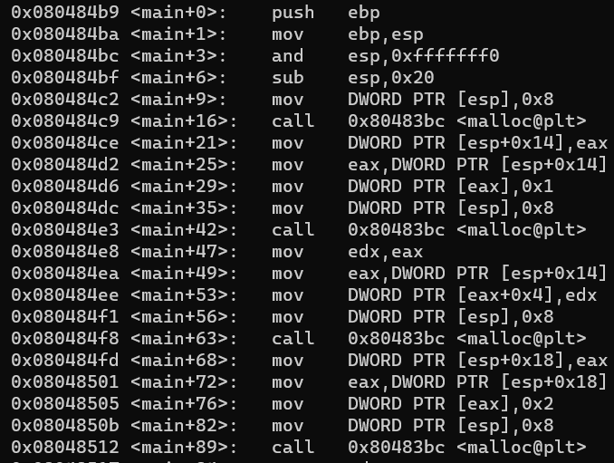
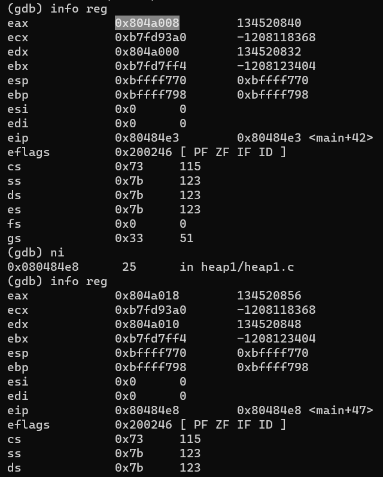
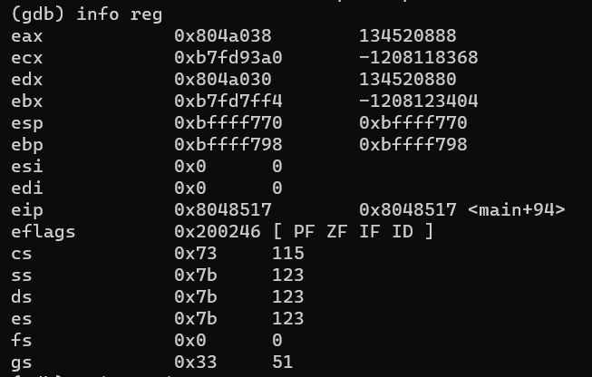

# Analysis

* We are given with the below source code:

    

* Lets try some random inputs:

    

*  We have a buffer overflow on the *name* buffer that is allocated on the heap.

    - Just like the stack, heap memory is allocated contiguously. 
    
    - This means that if we write past the buffer, we will be overwriting another data structure.

* Our goal, still, is to execute the *winner* function.

# Exploit

* Load this in GDB:

    

* Set breakpoints at each of the last 3 malloc functions (skip the first one), we examine the value of EAX to see the memory address of every components in the  *internet* struct:

    

    - i1 at 0x0804a008 –> i1.priority at 0x0804a008 (size 4) –> i1.name at 0x0804a00c (size 4) —-> memory area pointed by i1.name at 0x0804a018.

    

    - Similarly, i2 at 0x0804a028 –> i2.priority at 0x0804a028 (size 4) –> i2.name at 0x0804a02c (size 4) —-> memory area pointed by i2.name at 0x0804a038.

* Okay here comes the idea: we can overwrite argv[1] with the address of *puts* and argv[2] with the address of *winner*. So when it gets executed, we can execute another function instead. Thats nice, we can write any arbitrary content (argv[2]) in any arbitrary address (controlled by argv[1]).

* Lets find the memory address of *winner* and *puts*:

    
    

* Again, we want to find how many bytes we need for the padding. 0x0804a02c - 0x0804a018 = 0x14 = 20.

* Boom:

    

# The bugs:

* This level is vulnerable because we can pass as many bytes as we want via the *name[64]* and the *strcpy*:

    

