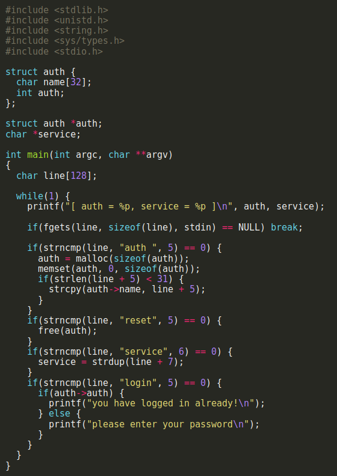
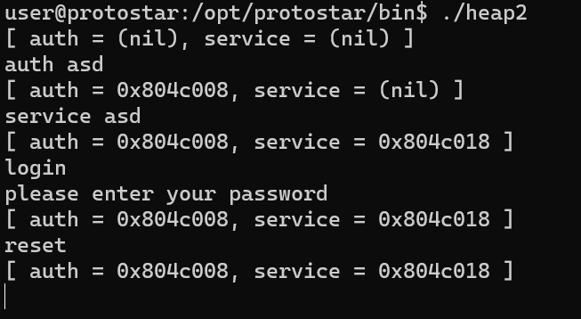
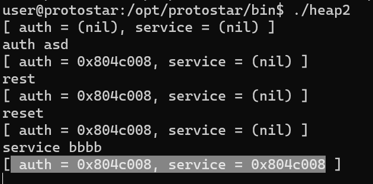
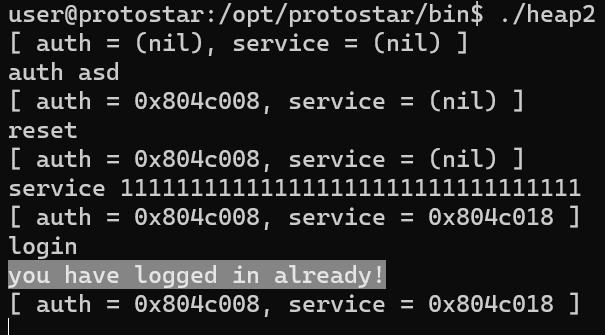

# Analysis

* We are given with the below source code:

    
    
* It says: "This level examines what can happen when heap pointers are stale". This introduces us a new type of vulnerablity: *use-after-free*:

    

* Let me run this:

    

* Looks like the *auth* still points to the original memory location after the *reset* command (which calls *free(auth)*). The *login* command then accesses the freed memory with *auth->auth*. 

* Our goal here is to have the program print "you have logged in already!". Which means we have to overwrite the original struct's *auth* member with a number other than 0.

* But how can we set the "auth" integer if it isn't referenced anywhere in the program? We could try to overflow the "name" variable, but the bounds checking is pretty tight (the "if(strlen(line + 5) < 31)" check).

# Exploit

* From the given code, I know that the *auth* command will allocate space for the *auth*'s struct. 

* *reset* will free it, and *service* will allocate memory on the heap of the duplicated string by the *strdup()* function:

    

* Okay, so what if we do the *auth*, then the *reset*, then the *service*?

    - First, it will allocate space for *auth*'s struct.

    - Then it will free it

    - Then it will allocate a new chunk of memory for the duplicated string we supply. But where specifically is that allocated space?

    - If u remember, heap chunks are assigned on a "best fit" basis, which means if one is freed, the new allocated memory location will be the same as the freed one, since there are no chunks in use!

        

    - So after the *service* command, the location will be the same as the freed one:

        

    - See, this is different from the time we didn't put *reset* in between *auth* and *service*:

        

* With that being said, after using *auth* and *create*, *auth* still has its pointer. And if we call *service* right after that, they will point to the same location in the memory!

* This means that, if we enter *service* with a long enough input to be copied via strdup, we can overwrite the struct's * auth*. Remember, "auth->auth" is interpreted as "the pointer to the struct 'auth' plus an offset of 32 bytes which is where integer auth is expected to be". 

* So *name* is of size 32, lets try 31 "1"'s:

    

# Bugs

* As mentioned before, this is a significant vulnerability called "use after free," in which a pointer to freed memory remains in use by a program. Also, *strcpy* is vulnerable.

