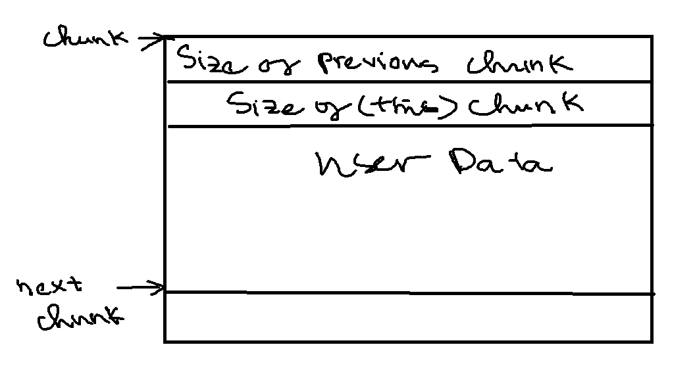
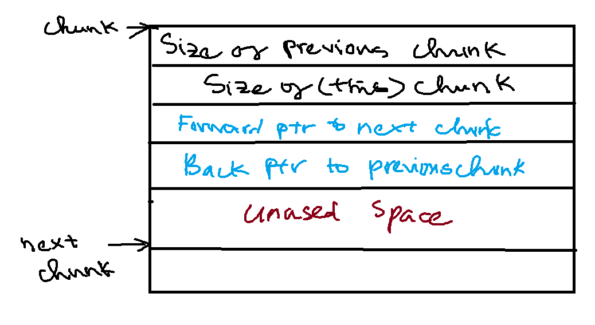
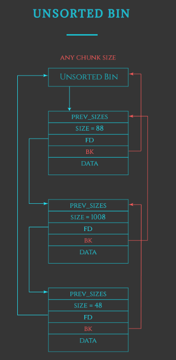
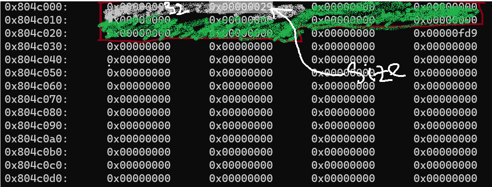
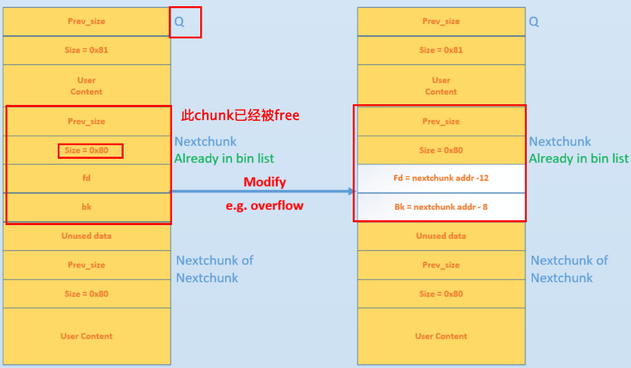
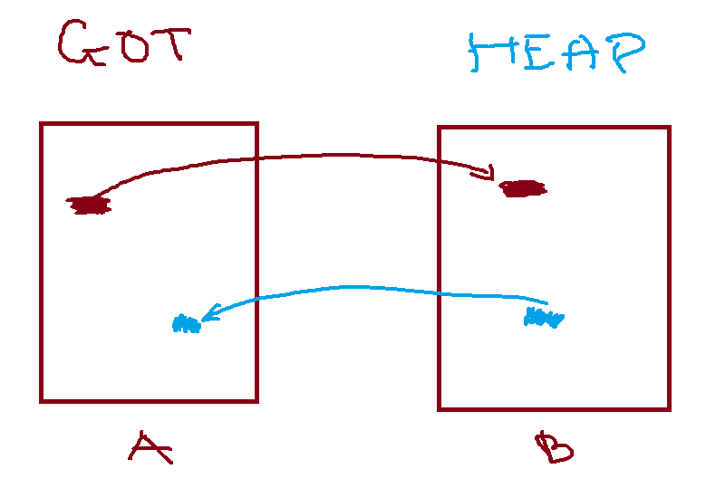
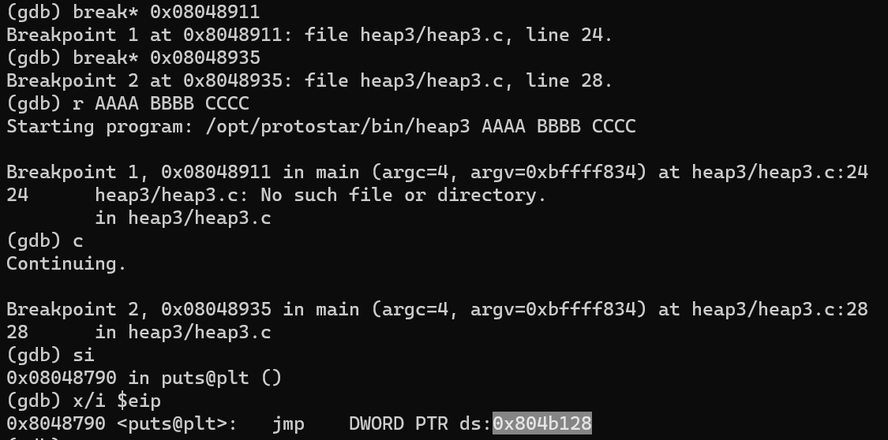

# Analysis

* We are given with the below source code:

    

* Try some random inputs:

    

* So, there are 3 malloc's and 3 free's in reverse order.

* This level introduces the Doug Lea Malloc (dlmalloc) and how heap meta data can be modified to change program execution. The goal for this level is to call the <span style="color:red">*winner*</span> function.

# Exploit

* As the discription says, this level is about corrupting heap metadata. So there is an issue with the heap algorithm, in this case in the <span style="color:red">*free()*</span> function, that we can use to redirect code execution to <span style="color:red">*winner()*</span>.

* There's a great article on how to implement glibc heap: https://azeria-labs.com/heap-exploitation-part-1-understanding-the-glibc-heap-implementation/. 

* Apparently, an allocated chunk will look something like this:

    

* And this is what a freed one looks like:

    

* As you can see, this is some sort of a doubly linked-list. Internally, the heap manager needs to keep track of freed chunks so that malloc can reuse them during allocation requests. This is done by maintaining a series of lists called “bins”, which are designed to maximize speed of allocations and frees.

* The chunk is then stored in an <span style="color:red">*unsorted bin*</span>, which is used for temporary storage of freed chunks which reduces the allocator's overhead:

    

* Ok lets open this in GDB. Set breakpoints at each library function call: <span style="color:red">*malloc, strcpy, free and puts*</span>. 

    

* Now run it and continue until arriven to the first <span style="color:red">*strcpy*</span>. Then check for memory for the heap:

    

    - So the heap area range from 0x804c000 to 0x804d000. 

    - We'll define a hook stop to always print 56 words of this area when we hit a breakpoint.

    

* When we now re-run the program, we can see how the heap develops. 

    - Before we execute the first <span style="color:red">*malloc*</span>, we don't have a heap yet. After the first  <span style="color:red">*malloc*</span>, we can now see the first object on the heap:

        

    - The size of the current chunk is 0x29. The last bit indicates if the previous chunk is in use. And because it's the first chunk, there's no valid memory before that. Thus it has the bit set indicate that that memory is not available, not free. 

    - This means the true size of the chunk is 0x28 (40 bytes). This makes sense because <span style="color:red">*malloc*</span> usually allocate more bytes than we need because it needs space for metadata. 

    - After the first chunk is a huge free block still available for allocation. And obviously it has the last bit set because the previous chunk is in use:

        

    - Then we malloc the second object, same size, last bit set.  As you can see, the top chunk is updated and it has now less free space:

        

    - And then the last object, same size, last bit set:

        

    - Next we execute the <span style="color:red">*strcpy*</span>. So we copy the first arg (the As) to the first chunk, Bs for the second chunk and Cs for the last chunk: 

        

    - Obviously we could have written a lot more and completely overwrite everything, including the chunk's size, which is the heap metadata. 

* Now we're gonna free them:

    

    - So the last chunk was freed, Cs was overwritten with zero. This chunk now is considered "fastbin" by malloc. Lets free the next one:

        

    - This time Bs got overwritten with an address, and it points to the other freed block (as I said before, it's some kind of linked-list). Okay, continue and free the next one:

        

* Okay, the maximum fastbin chunk size is 80, our chunk sizes are 32, so we want to make sure that we overwrite the size of the chunk we handle. Here is the source code for the "unlink" macro in "free" which we will aim to exploit;

```
/*
  ------------------------------ free ------------------------------
*/
... ... ...
/*
      If eligible, place chunk on a fastbin so it can be found
      and used quickly in malloc.
    */
    if ((unsigned long)(size) <= (unsigned long)(av->max_fast)

... ... ...

    /*
       Consolidate other non-mmapped chunks as they arrive.
    */

    else if (!chunk_is_mmapped(p)) {
      nextchunk = chunk_at_offset(p, size);
      nextsize = chunksize(nextchunk);

      /* consolidate backward */
      if (!prev_inuse(p)) {
        prevsize = p->prev_size;
        size += prevsize;
        p = chunk_at_offset(p, -((long) prevsize));
        unlink(p, bck, fwd);
      }
```

* If we want to reach the code here (which contains the "unlink" we want to exploit), we have to make sure that the IS_MMAPPED flag is not set.

    - Then we get the address of next chunk, which we can calculate based on the size of the current chunk. So with an overflow, the size is something we can control, which means, we can "fool" <span style="color:red">*free()*</span> into thinking some other data is the next chunk!

    - After that is the check if the previous chunk is in use. If it's not, we move on to calculate the address of the previous chunk, which again is something we can control. 

    - Now comes to the magic part: "unlink". This is how it's define:

    ```
    /* Take a chunk off a bin list */
    #define unlink(P, BK, FD) {
        FD = P->fd;
        BK = P->bk;
        FD->bk = BK;
        BK->fd = FD;
    }
    ```

* The first parameter "p" is the block before our current block, which we got by following the prev_size. 

    

    - We take the forward and backward (fd, bk) of that chunk, which is the first and second word after the "size" and put it in FD and BK. Next 2 lines, we write the address BK to the address where FD is pointing to (same thing for FD). 

* Then, “unlink” will be executed to generate our arbitrary write: the forward pointer plus an offset (12) will equal the backward pointer, while the backward pointer plus an offset (8) will equal the forward pointer. Thus, if we set the forward pointer to Address A minus 12, and set the backward pointer to Address B, the value at Address A will be overwritten with Address B.

    

    - Now you might wonder, why 12 and 8? Well, first of all, we use "->" to access properties of a struct on a heap. For example, "auth->service". Now what that really means is: Take the pointer of the "auth" struct and add the proper amount of bytes until the "service" section begins.

    - So the unlink part from the source code will say "take the address of the beginning of the heap chunk and add 12, since at that address will ALWAYS be the forward pointer in case this chunk wants to be unlinked".

    - And since we are abusing this forward pointer stuff with the "->" arrow, the innocent unlink thingy thinks we wanna jump to the address we give to it + 12 bytes since at that address (in a normal heap chunk) will always be the forward pointer. So we give it the GOT address MINUS 12 because the unlink function will ADD 12. Make sense?

    

* Okay now, BK could be the address of the <span style="color:red">winner()</span> function, and FD +12 could be our GOT entry for puts.This would overwrite the GOT entry with <span style="color:red">winner()</span> function.

* But, think about it, it you have 2 segments A and B, we can write an address from segment A to segment B, and from B to A. Supposed the GOT is segment A and the HEAP is the other one. 

    

    - This would allow us to write an address from the HEAP to the GOT, and from GOT to the HEAP, which means we can redirect code execution via the GOT to the shellcode that we can place on the HEAP. And this shellcode calls <span style="color:red">winner()</span> for us.

* None of this seems too difficult in theory, especially if we are already to overwrite all of this metadata with "strcpy". So, we want to set the "prev_size" to point to the previous block we want to merge with. However, "strcpy" ceases copying when it hits null bytes, which means we won't be able to overwrite the "prev_size" and "size" internals of the chunk metadata unless we use massive values (arcoding to "Once upon a free()")! 

* This means we can't go that way, since our heap is not that big. But the clever idea in the article make use of how computers handle negative values. For example, 0x64 + 0xfffffffc = 0x64 - 0x4 = 0x60 (with the overflow flag set). We can do this because in the code how size is used, it's just used as an offset which is added to an address. It doesn't check that it's a ridiculously huge chunk. 

* I will draw everything out real quick:

    

    - It will take the size of that chunk, adds it the the current address to find the next chunk, which fools <span style="color:red">free()</span> into thinking the next chunk is at -4 from here.

* What happens if we use both 0xfffffffc for both the "prev_size" and "size" values? Let's step through the relevant pieces of "free" again:

    - 1, We have to overflow the size of our chunk with a bigger value than 80 (maximum size of fastbins). Lets use 4,294,967,292 (0xfffffffc).

    - 2, Check if the chunk is mmapped via the 0x2 bit of “size,” which is the second doubleword of the chunk metadata. 0xfffffffc does not have this bit set, so we proceed.

    - 3, Check the "prev_inuse" via the last bit set of “size” to determine whether the chunk is in use or not. 0xfffffffc does not have this bit set, so we proceed.

    - 4, Now, it will merge them. First, it needs to reference the previous chunk. It does this by calculating the previous chunk’s pointer by subtracting “prev_size” (the first doubleword of the chunk metadata) from the current chunk’s pointer. This results in integer overflow and instead adds 4 bytes to the current chunk header to calculate the previous chunk address.

    - 5, It will call the “unlink” macro on the previous chunk (using the calculated pointer from step 4) to attempt to remove it from its current linked list. The calculated previous pointer is simply four bytes ahead of the chunk being freed. Thus, the forward and backward pointers are within the user data section of the chunk.

    - 6, “unlink” will operate as listed in the source code above to generate our arbitrary write.

* This should work! But now, the question we've postponed until now: what value do we write, and where? We could overwrite the entry for "puts" with the address of "winner", so that when "puts" is called, "winner" is executed instead. However, in this case it won't work: remember that "unlink" has two writes, and the second would mean that we try to write an entry from the Global Offset Table near the address of "winner," which is read-only memory.

* If you take a look at the picture (the one with 2 segment A and B), you'll see that we are able to write to heap as well. That's where we'll be heading. Okay now lets find the address of <span style="color:red">*winner()*</span>:

    

* Set breakpoints at the first call to <span style="color:red">*free()*</span> and <span style="color:red">*puts()*</span>, and view the address of <span style="color:red">*puts()*</span>:

    

* Looking good, but let's not forget to subtract 12 (0xC), which is the offset that "free" applies. We will use 0x804b11c.

* Now, the last missing piece of our exploit: the shellcode. With <span style="color:red">*nasm_shell*</span>, we can generate a <span style="color:red">*push 0x8048864; ret*</span> instruction. Thus gives me: "\x68\x64\x88\x04\x08\xC3".

    - \x68 is push instruction.
    - \xc3 is return opcode.

* We will place our shell code at the start of the heap using our first <span style="color:red">*strcpy()*</span>. And one more thing, we want to start the shellcode after writing 4 bytes because the initial 4 bytes of data for each chunk will be overwritten when the chunk is freed. And since we know that our heap memory starts at 0x804c000, we know that our shell code starts at 0x804c00c. To recap:

    - Buffer "a" will contain 4 bytes, then the address of "winner".

    - Buffer "b" will contain 32 random bytes, followed by an overflow into the metadata of buffer "c." The "prev_size" and "size" of "c" will both be overwritten with 0xfffffffc (so we will multiple it by 2), and then there will be 4 random bytes. After that, we provide the address of "puts" minus 12 (0x804b11c) and the address of our shellcode (since we know that our heap memory starts at 0x804c000, we know that our shell code starts at 0x804c00c).

    - Buffer "c" will have fewer than 3 bytes so as to not overwrite the prior overwrite! (3 bytes as Python adds a newline)

* Okay lets run this:

```
user@protostar:~$ /opt/protostar/bin/heap3 `python -c "print 'AAAA\x68\x64\x88\x04\x08\xc3'"` `python -c "print 'A' * 32 + '\xfc\xff\xff\xff' * 2 + 'A' * 4 + '\x1c\xb1\x04\x08' + '\x0c\xc0\x04\x08'"` DDD
that wasn't too bad now, was it? @ 1665789039
```

# The bugs:

* As mentioned before, this is a significant vulnerability called "use after free," in which a pointer to freed memory remains in use by a program.


