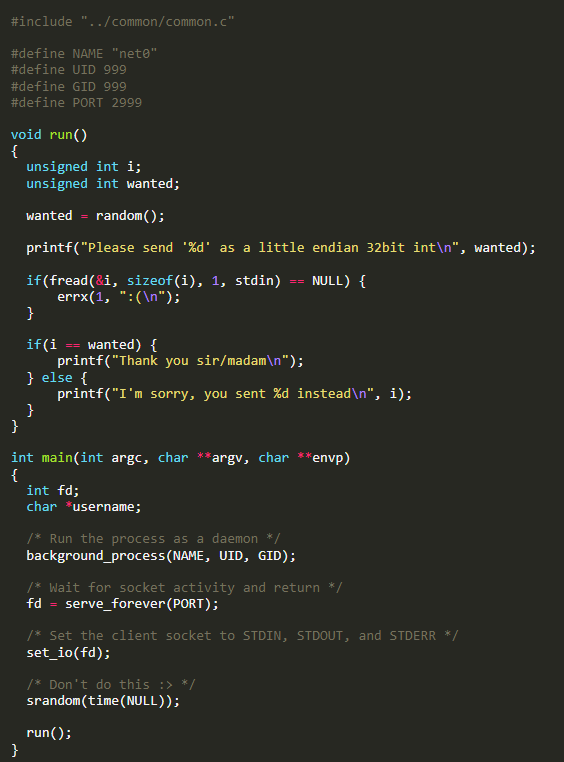
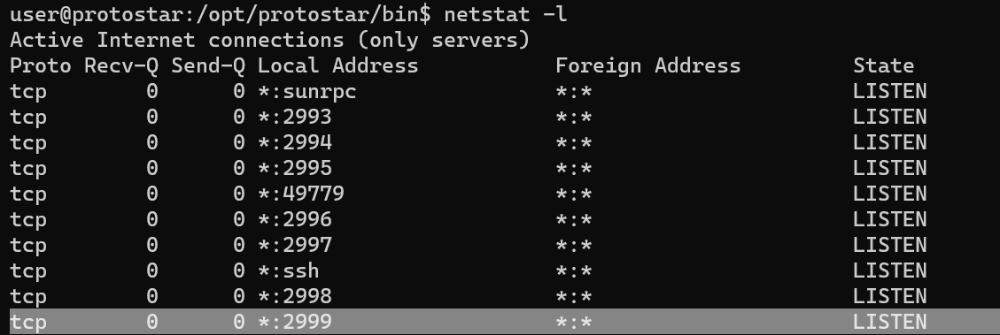
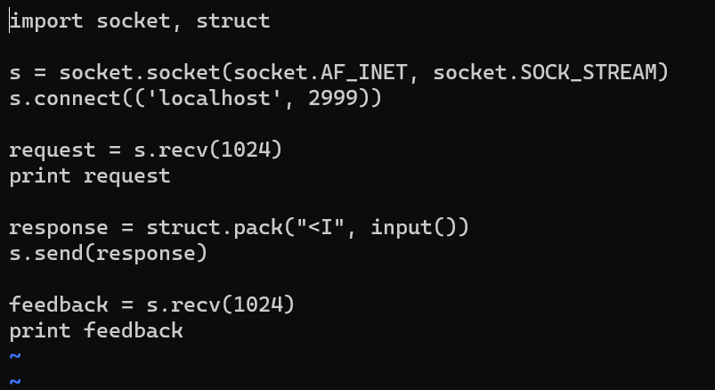

# Analysis

* We are given with the below source code:

    

* Okay, so it defines a *run()* function, then serves it indefinitely via some custom functions on port 2999. If we enter the "ps" command to show current processes and search for "net0," we find that it is already running:

    

    - a:- This option prints the running processes from all users.

    - u:- This option shows user or owner column in output.

    - x:- This option prints the processes those have not been executed from the terminal.

* Additionally, we can call "netstat -l" to show all currently listening sockets. If we scan it, we find net0's port - 2999 - is listening:

    

    - Looks like it's already awaiting our input.

* Notice how in *main()*, we don't have a manual page for *background_process, set_io or serve_forever*? Well, these are not common libc function. And if you look at the #include, you'll see that there are some other codes that we can't see. 

* In *run()*, first it generates a random number, then "fread" reads whatever we send via stdin into a buffer titled "i" and then compares it to the random number, and gives us feedback accordingly.

# Exploit

* Okay, first of all, how do we run this? If you try to run it, nothing happens:

    

* How about netcat? Lets use it to establish a TCP connection with this port (2999):

    

* Now we need to get the string representation of that number:

    

* Okay, so how do we pass this into netcat? Well, just write a simple python script to get the string representation of that number then pass it back into netcat:

    

    - recv() is used to get the respond from the server.

* Now run it:

    

* For more information, check out this link: https://www.youtube.com/watch?v=2CL-AAcgyuo&list=PLhixgUqwRTjxglIswKp9mpkfPNfHkzyeN&index=32

# Bugs

* Well, there is no actually vulnerabilities in this level. We just make use of what's already there, in a tricky way.

