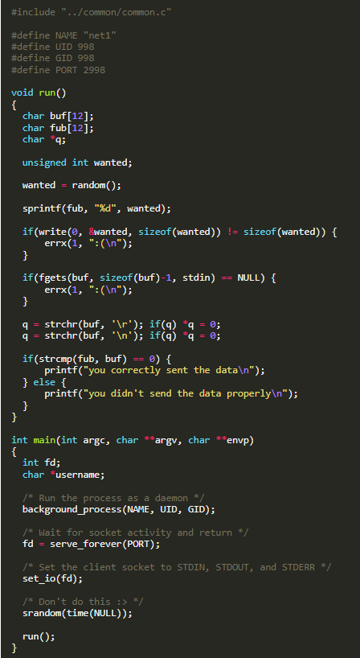

# Analysis

* We are given with the below source code:

    

* This level is very similar to the previous one but this time asks for the opposite: to convert binary integers into ASCII characters.

* The <span style="color:red">main</span> hasn't changed, so lets examine <span style="color:red">run</span>:

    - First, a random integer is generated and put into the "wanted" variable. ]

    - Then, it is loaded into the "fub" character buffer via "sprintf." 
    
    - Next, "fgets" takes our input and places it into the "buf" character buffer.

    - Finally, "fub" and "buf" are compared, and we want them to be equal, so as to print "you correctly sent the data".

# Exploit

* Lets use netcat like in the previous level to connect to net1. But remember to change the port:

    

* So now we want to convert whatever net1 return to its original representation with the integer format. 

    - Note that the string that we receive from net1 (fub) contains no additional text, so we can convert it directly within the Python program without any string splicing.

* Lets update our script:

```
import socket, struct

s = socket.socket(socket.AF_INET, socket.SOCK_STREAM)
s.connect(('localhost', 2998))

request = s.recv(1024)
print request

response = str(struct.unpack("<I", request)[0])
s.send(response)

feedback = s.recv(1024)
print feedback 
```

* This <span style="color:red">unpack()</span> function results in a tuple, even if it is only one item, so we must use "[0]" to pull it out, and then <span style="color:red">str()</span to convert from integer to string before printing and sending.

* Boom:

    

# Bugs

* Just like the previous video, there are no significant bugs.


