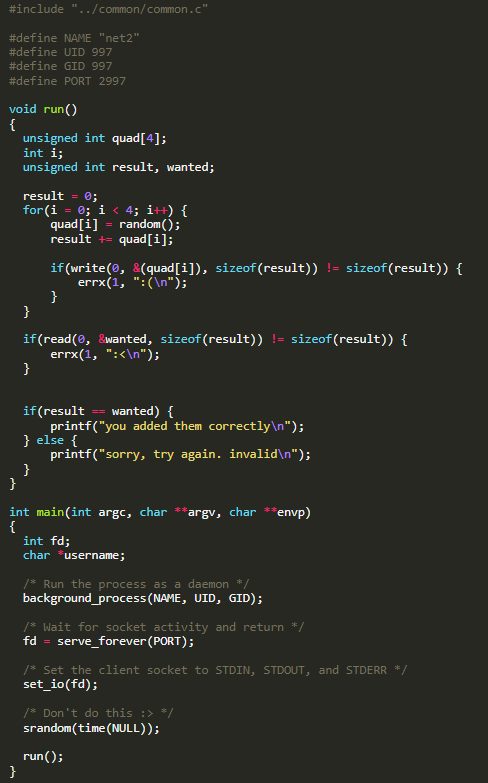

# Analysis

* We are given with the below source code:

    

* The <span style="color:red">main</span> hasn't changed, so lets examine <span style="color:red">run</span>:

    - 4 random unsigned integers are loaded into the integer array "quad," and subsequently added to a running total integer "result".

    - Finally, the input we provide via "read" is compared against this "result" variable, and feedback is provided accordingly.

* Okay, one more thing to keep in mind, we add 4 32-bit integers, then stored it in another 32-bit integer. So we have to take care of that integer wrapping thing too.

# Exploit

* Lets try to connect to this:

    

    - Notice that according to the source code, this (2) should be the first integer.

* We will write a script with a loop which will do two things: 
    
    - Unpack the binary integer.
    - Sum it to a running total variable called "total".
    - Avoid the integer wrapping by AND-ing it with "0xFFFFFFFF" to ensure it remains 32-bit.

```
import socket, struct

s = socket.socket(socket.AF_INET, socket.SOCK_STREAM)

s.connect(('localhost', 2997))

total = 0
for i in range(4):
    val = int(struct.unpack("I", s.recv(4))[0])
    total += val
    print val

total &= 0xffffffff

to_send = struct.pack("I", total) + "\n"

s.sendall(to_send)
print s.recv(1024)
```

* Boom:

    

# The bugs:

* Just like the previous video, there are no significant bugs.


