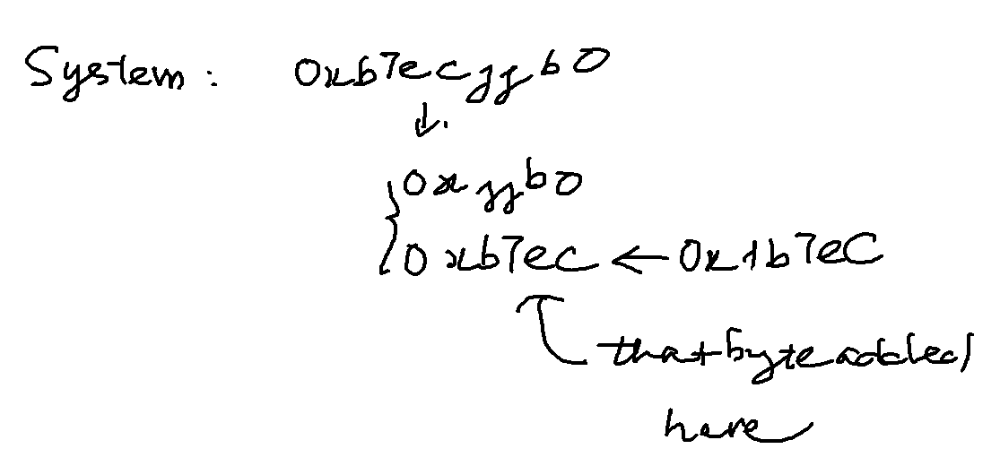
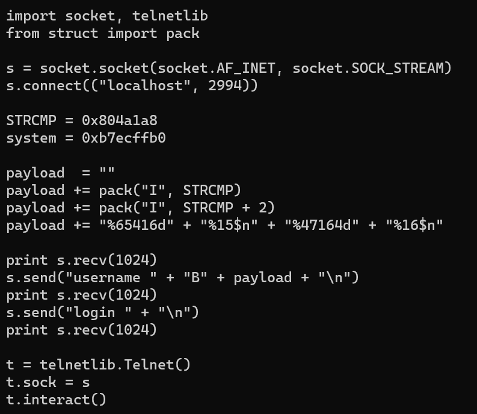
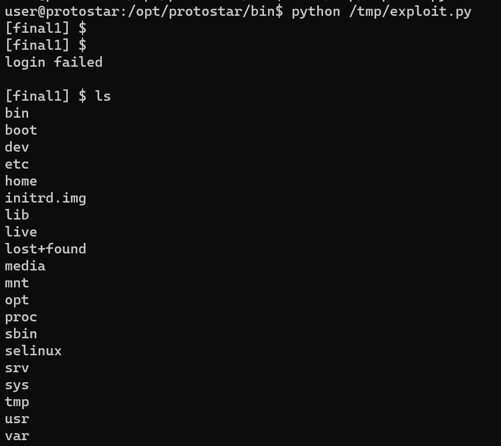

# Analysis

* We are given with the below source code:

```
#include "../common/common.c"

#include <syslog.h>

#define NAME "final1"
#define UID 0
#define GID 0
#define PORT 2994

char username[128];
char hostname[64];

void logit(char *pw)
{
  char buf[512];

  snprintf(buf, sizeof(buf), "Login from %s as [%s] with password [%s]\n", hostname, username, pw);

  syslog(LOG_USER|LOG_DEBUG, buf);
}

void trim(char *str)
{
  char *q;

  q = strchr(str, '\r');
  if(q) *q = 0;
  q = strchr(str, '\n');
  if(q) *q = 0;
}

void parser()
{
  char line[128];

  printf("[final1] $ ");

  while(fgets(line, sizeof(line)-1, stdin)) {
      trim(line);
      if(strncmp(line, "username ", 9) == 0) {
          strcpy(username, line+9);
      } else if(strncmp(line, "login ", 6) == 0) {
          if(username[0] == 0) {
              printf("invalid protocol\n");
          } else {
              logit(line + 6);
              printf("login failed\n");
          }
      }
      printf("[final1] $ ");
  }
}

void getipport()
{
  int l;
  struct sockaddr_in sin;

  l = sizeof(struct sockaddr_in);
  if(getpeername(0, &sin, &l) == -1) {
      err(1, "you don't exist");
  }

  sprintf(hostname, "%s:%d", inet_ntoa(sin.sin_addr), ntohs(sin.sin_port));
}

int main(int argc, char **argv, char **envp)
{
  int fd;
  char *username;

  /* Run the process as a daemon */
  background_process(NAME, UID, GID); 
  
  /* Wait for socket activity and return */
  fd = serve_forever(PORT);

  /* Set the client socket to STDIN, STDOUT, and STDERR */
  set_io(fd);

  getipport();
  parser();

}
```

* <span style="color:red">*main*</span> calls 2 functions: <span style="color:red">*getipport*</span> and <span style="color:red">*parser*</span>:

    - <span style="color:red">*getipport*</span> uses the <span style="color:red">*getpeername*</span> function to obtain our IP address and port, and then store those via <span style="color:red">*sprintf*</span> into <span style="color:red">*hostname*</span>.

        

    - <span style="color:red">*parser*</span> reads our input in a loop, printing "[final1] $" each time and removing a couple whitespace characters via the <span style="color:red">*trim*</span> function before actually parsing our input. 
    
    - If we enter "username" and then some other input, that additional input is copied into a 128-byte <span style="color:red">*username<*/span> buffer. If we enter "login " plus some input, the program first checks to see whether we've entered a username and, if we have, it passes our extra input as the sole "pw" argument for a <span style="color:red">*logit*</span> function.

    - Finally, <span style="color:red">*logit*</span> declares a 512-byte buffer called <span style="color:red">*buf*</span> and fills it using <span style="color:red">*sprintf*</span>. This formatted string contains data from "hostname", "username", and "password", as is passed into <span style="color:red">*syslog*</span>:

        

    - <span style="color:red">*syslog*</span> is called using "void syslog(int priority, const char *format, ...)". The "priority" argument is passed into by ORing "LOG_USER" and "LOG_DEBUG", and "buf" (which contains "hostname," "username," and "password") is passed in as the "format" argument.
        
    - How ever, passing in a buffer of user input should be done via a conversion character such as "%s" for a string - it should never be passed in directly! This means that we should be able to pass in our own conversion characters to pop values from the stack:

        

# Exploit

* Lets put in some format string modifiers to see if it has a vulnerability:

    

* Using "cat /var/log/syslog", we can see the hex value of what we've entered:

    

    - As you can see, %x helps us leak values from the stack. 
    
* If you increase the number of %x to 15, we should be able to reach the start of our input: "AAAA":

    

    - Do you see how it splits into 2 part? How can we do about this? Well just simply add another byte before our "AAAA" and it should work fine (I use "B"):

        
        
* Okay, so how do we prepare for our exploit? We could provide some shellcode using our buffer and then overwrite a stack return address with the address of our shellcode, but the stack may not be executable. So we can try to overwrite the address in the global offset table with the address of another function, like <span style="color:red">*execvs*</span>, to get a remote shell; or <span style="color:red">*system*</span>, to execute command.

* Now we need to determine which libc funcion we want to overwrite. Within the loop in <span style="color:red">*parser*</span>, we have <span style="color:red">*printf*</span> and <span style="color:red">*strncmp*</span>, and both are called once input is provided. 

* But, the first argument of <span style="color:red">*strncmp*</span> is "line", which is our input buffer. Thus, if we overwrote the address of <span style="color:red">*strncmp*</span> in the GOT with the address of <span style="color:red">*system*</span>, whatever input we provide afterwards will be the first argument used!

* Let's now load the program in GDB so we can grab those addresses. Set a break at <span style="color:red">*main*</span> so we can run the program and force it to link the libc functions:

```
(gdb) break *main
Breakpoint 1 at 0x8049ab9: file final1/final1.c, line 68.
(gdb) r
Starting program: /opt/protostar/bin/final1
...
(gdb) x system
0xb7ecffb0 <__libc_system>:     0x890cec83
(gdb) disas parser
Dump of assembler code for function parser:
...
0x0804997f <parser+66>: call   0x8048d9c <strncmp@plt>
...
(gdb) x/i 0x8048d9c
0x8048d9c <strncmp@plt>:        jmp    *0x804a1a8
```

* Cool, we have the addresses of <span style="color:red">*system*</span> and <span style="color:red">*strncmp*</span> in the GOT. But remember the byte we add earlier? The "BAAAA"? Well we gonna add it here. I'll draw everything out:

    

* Here is our final exploit. I use the telnet trick like in the previous challenges:

    

    - STRCMP is the least-significant half of <span style="color:red">*strncmp*</span> (since we write 4 bytes at a time).

    - STRCMP +2 is the most-significant half of <span style="color:red">*strncmp*</span>.

    - %65416d and %47164d can be calculated like in our format string exploit.

    - `%15$n` is the 15th argument, which goes along with the STRCMP, `%16$n` goes along with STRCMP + 2.

* And the result:

    

# Bugs

* In this challenge, the vulnerability is at the <span style="color:red">*syslog*</span> function and the <span style="color:red">*strcmp*</span> which we use to overwrite the address of <span style="color:red">*system*</span>.


