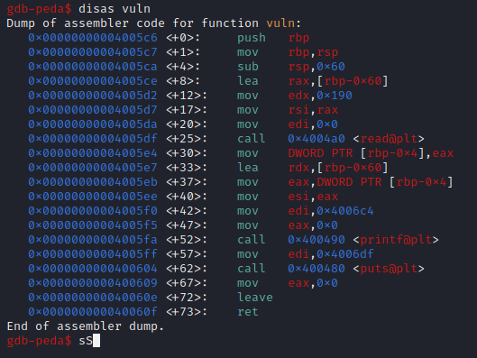
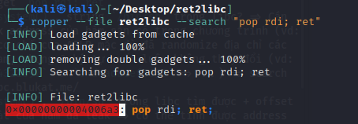
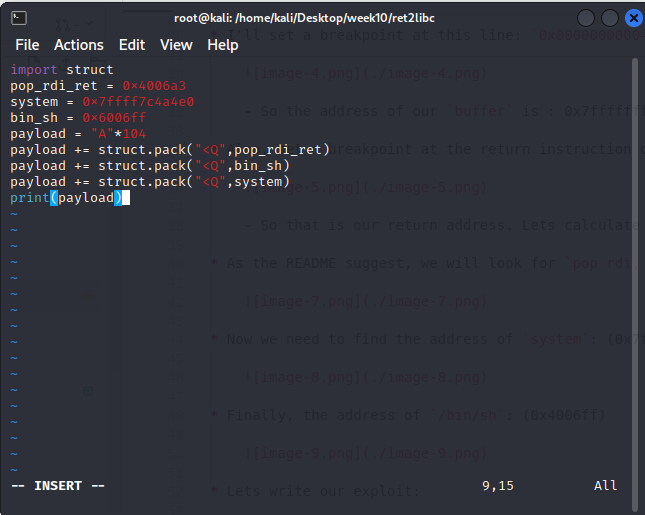
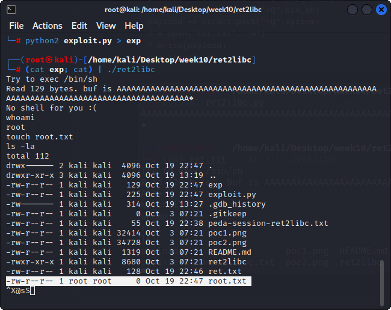

# Analysis

* First lets do a `checksec` to see how we can deal with this:

    

    - Okay, NX (No Execute) is enabled, so we can't spawn a shell on the stack.

* There's a great article on how to bypass NX: https://kaizensec.blogspot.com/2022/04/bypass-nx-ret2libc-binary-exploitation.html

* According to that article, we will first need to disable ASLR:

    

* Okay lets see the list of functions:

    

* Looks like `vuln` is where we should be interested in.

# Exploit

* Disassembly `vuln`:

    

* I'll set a breakpoint at this line: `0x00000000004005ce <+8>:     lea    rax,[rbp-0x60]` to find the address of our `buffer`;

    

    - So the address of our `buffer` is : 0x7fffffffde60 - 0x60 = 0x7fffffffde00.

* Also, set a breakpoint at the return instruction of `vuln`:

    

    - So that is our return address. Lets calculate the distance between our `buffer` and this: 0x7fffffffdec8 - 0x7fffffffde00 = 0xc8 = 200.

* As the README suggest, we will look for `pop rdi, ret` gadget:

    

* Now we need to find the address of `system`: (0x7ffff7c4a4e0)

    

* Finally, the address of `/bin/sh`: (0x4006ff)

    

* Lets write our exploit:

    

* And the result:

    
    

# Bugs

